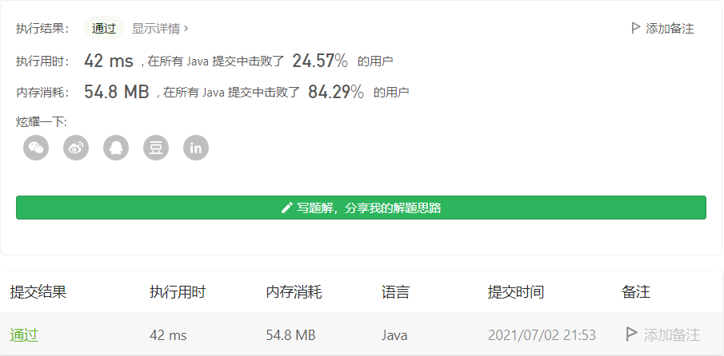

#### 1833. 雪糕的最大数量

#### 2021-07-02 LeetCode每日一题

链接：https://leetcode-cn.com/problems/maximum-ice-cream-bars/

标签：**贪心、数组、排序**

> 题目

夏日炎炎，小男孩 Tony 想买一些雪糕消消暑。

商店中新到 n 支雪糕，用长度为 n 的数组 costs 表示雪糕的定价，其中 costs[i] 表示第 i 支雪糕的现金价格。Tony 一共有 coins 现金可以用于消费，他想要买尽可能多的雪糕。

给你价格数组 costs 和现金量 coins ，请你计算并返回 Tony 用 coins 现金能够买到的雪糕的 最大数量 。

注意：Tony 可以按任意顺序购买雪糕。

示例 1：

```java
输入：costs = [1,3,2,4,1], coins = 7
输出：4
解释：Tony 可以买下标为 0、1、2、4 的雪糕，总价为 1 + 3 + 2 + 1 = 7
```

示例 2：

```java
输入：costs = [10,6,8,7,7,8], coins = 5
输出：0
解释：Tony 没有足够的钱买任何一支雪糕。
```

示例 3：

```java
输入：costs = [1,6,3,1,2,5], coins = 20
输出：6
解释：Tony 可以买下所有的雪糕，总价为 1 + 6 + 3 + 1 + 2 + 5 = 18 。
```


提示：

- costs.length == n
- 1 <= n <= 105
- 1 <= costs[i] <= 105
- 1 <= coins <= 108

> 分析

这题可以按任意顺序买雪糕，所以想想就是直接排序  + 遍历就行了。用前缀和也可以，但感觉占空间而且速度应该差不了多少。

> 编码

```java
class Solution {
    public int maxIceCream(int[] costs, int coins) {
        // 升序
        Arrays.sort(costs);
        int res = 0, len = costs.length;
        for (int i = 0; i < len; i++) {
            coins -= costs[i];
            if (coins < 0) {
                return i;
            }
        }

        if (coins >= 0) {
            return len;
        }
        return -1;
    }
}
```

