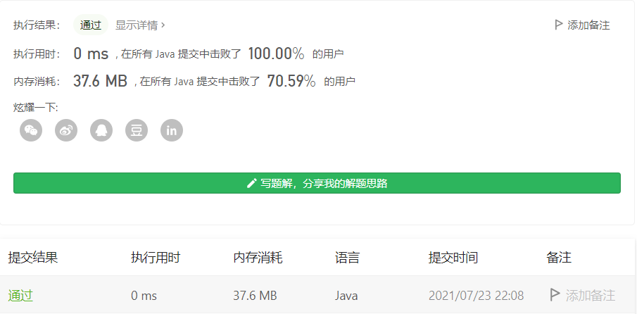

#### 1893. 检查是否区域内所有整数都被覆盖

#### 2021-07-23 LeetCode每日一题

链接：https://leetcode-cn.com/problems/check-if-all-the-integers-in-a-range-are-covered/

标签：**数组、哈希表、前缀和**

> 题目

给你一个二维整数数组 ranges 和两个整数 left 和 right 。每个 ranges[i] = [starti, endi] 表示一个从 starti 到 endi 的 闭区间 。

如果闭区间 [left, right] 内每个整数都被 ranges 中 至少一个 区间覆盖，那么请你返回 true ，否则返回 false 。

已知区间 ranges[i] = [starti, endi] ，如果整数 x 满足 starti <= x <= endi ，那么我们称整数x 被覆盖了。

示例 1：

```java
输入：ranges = [[1,2],[3,4],[5,6]], left = 2, right = 5
输出：true
解释：2 到 5 的每个整数都被覆盖了：

- 2 被第一个区间覆盖。
- 3 和 4 被第二个区间覆盖。
- 5 被第三个区间覆盖。
```

示例 2：

```java
输入：ranges = [[1,10],[10,20]], left = 21, right = 21
输出：false
解释：21 没有被任何一个区间覆盖。
```


提示：

- 1 <= ranges.length <= 50
- 1 <= starti <= endi <= 50
- 1 <= left <= right <= 50

> 分析

简单题，瞎写的~

> 编码

```java
class Solution {
    public boolean isCovered(int[][] ranges, int left, int right) {
        for (int i = left; i <= right; i++) {
            boolean flag = false;
            for (int[] nums : ranges) {
                if (i >= nums[0] && i <= nums[1]) {
                    flag = true;
                    break;
                }   
            }
            if (!flag) {
                return false;
            }
        }

        return true;
    }
}
```

