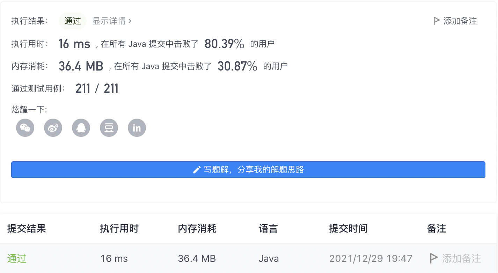
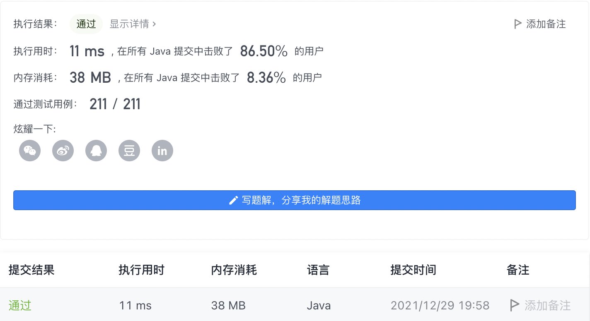

#### 1995. 统计特殊四元组

#### 2021-12-29 LeetCode每日一题

链接：https://leetcode-cn.com/problems/count-special-quadruplets/

标签：**数组、计数**

> 题目

给你一个 下标从 0 开始 的整数数组 nums ，返回满足下述条件的 不同 四元组 (a, b, c, d) 的 数目 ：

- nums[a] + nums[b] + nums[c] == nums[d] ，且
- a < b < c < d


示例 1：

```java
输入：nums = [1,2,3,6]
输出：1
解释：满足要求的唯一一个四元组是 (0, 1, 2, 3) 因为 1 + 2 + 3 == 6 。
```

示例 2：

```java
输入：nums = [3,3,6,4,5]
输出：0
解释：[3,3,6,4,5] 中不存在满足要求的四元组。
```

示例 3：

```java
输入：nums = [1,1,1,3,5]
输出：4
解释：满足要求的 4 个四元组如下：

- (0, 1, 2, 3): 1 + 1 + 1 == 3
- (0, 1, 3, 4): 1 + 1 + 3 == 5
- (0, 2, 3, 4): 1 + 1 + 3 == 5
- (1, 2, 3, 4): 1 + 1 + 3 == 5
```


提示：

- 4 <= nums.length <= 50
- 1 <= nums[i] <= 100

> 题目

解法1：因为数组的长度是[4, 50]，所以直接暴力4层循环也是没问题的。

解法2：从后往前遍历b，同时用哈希表记录下[b + 1, len - 1]之间num[d] - num[c]所有的可能值，然后a从[0, b - 1]开始遍历，查看num[a] + num[b]在哈希表中是否存在，如果存在则加上值。

> 编码

```java
class Solution {
    public int countQuadruplets(int[] nums) {
        int ans = 0, len = nums.length;
        for (int i = 0; i < len; i++) {
            for (int j = i + 1; j < len; j++) {
                for (int m = j + 1; m < len; m++) {
                    for (int n = m + 1; n < len; n++) {
                        if (nums[i] + nums[j] + nums[m] == nums[n]) {
                            ans++;
                        }
                    }
                }
            }
        }

        return ans;
    }
}
```



```java
class Solution {
    public int countQuadruplets(int[] nums) {
        int ans = 0, len = nums.length;
        Map<Integer, Integer> map = new HashMap<>();

        for (int b = len - 3; b >= 0; --b) {
            for (int d = b + 2; d < len; d++) {
                map.put(nums[d] - nums[b + 1], map.getOrDefault(nums[d] - nums[b + 1], 0) + 1);
            }

            for (int a = 0; a < b; a++) {
                if (map.containsKey(nums[a] + nums[b])) {
                    ans += map.get(nums[a] + nums[b]);
                }
            }
        }

        return ans;
    }
}
```

