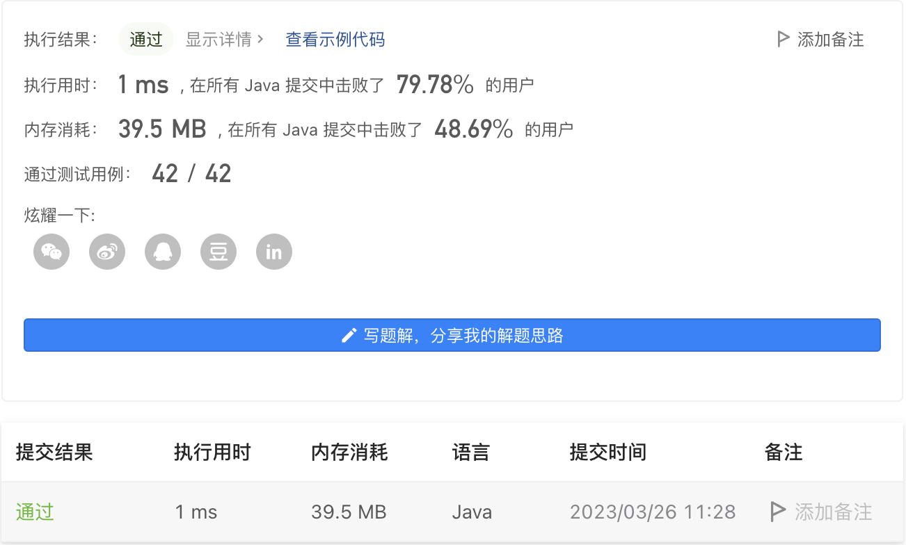

#### 2395. 和相等的子数组

#### 2023-03-26 LeetCode每日一题

链接：https://leetcode.cn/problems/find-subarrays-with-equal-sum/

标签：**数组、哈希表**

> 题目

给你一个下标从 0 开始的整数数组 nums ，判断是否存在 两个 长度为 2 的子数组且它们的 和 相等。注意，这两个子数组起始位置的下标必须 不相同 。

如果这样的子数组存在，请返回 true，否则返回 false 。

子数组 是一个数组中一段连续非空的元素组成的序列。

示例 1：

```java
输入：nums = [4,2,4]
输出：true
解释：元素为 [4,2] 和 [2,4] 的子数组有相同的和 6 。
```

示例 2：

```java
输入：nums = [1,2,3,4,5]
输出：false
解释：没有长度为 2 的两个子数组和相等。
```

示例 3：

```java
输入：nums = [0,0,0]
输出：true
解释：子数组 [nums[0],nums[1]] 和 [nums[1],nums[2]] 的和相等，都为 0 。
注意即使子数组的元素相同，这两个子数组也视为不相同的子数组，因为它们在原数组中的起始位置不同。
```


提示：

- 2 <= nums.length <= 1000
- -10 ^ 9 <= nums[i] <= 10 ^ 9

> 分析

循环求和，判断是否出现相同的和即可。

> 编码

```java
class Solution {
    public boolean findSubarrays(int[] nums) {
        Set<Integer> vals = new HashSet<>();
        for (int i = 0; i < nums.length - 1; i++) {
            int sum = nums[i] + nums[i + 1];
            if (vals.contains(sum)) {
                return true;
            }
            vals.add(sum);
        }

        return false;
    }
}
```

