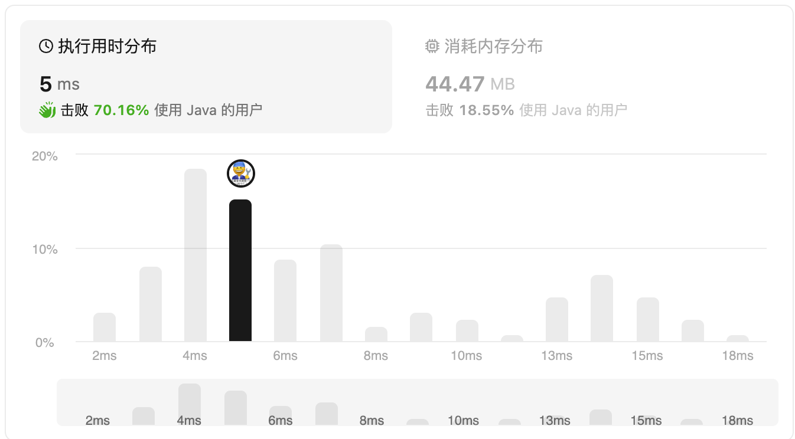

#### 2670.找出不同元素数目差数组

#### 2024-01-31 LeetCode每日一题

链接：https://leetcode.cn/problems/find-the-distinct-difference-array/

标签：**数组、哈希表**

难度：简单

> 题目

给你一个下标从 **0** 开始的数组 `nums` ，数组长度为 `n` 。

`nums` 的 **不同元素数目差** 数组可以用一个长度为 `n` 的数组 `diff` 表示，其中 `diff[i]` 等于前缀 `nums[0, ..., i]` 中不同元素的数目 **减去** 后缀 `nums[i + 1, ..., n - 1]` 中不同元素的数目。

返回 `nums` 的 **不同元素数目差** 数组。

注意 `nums[i, ..., j]` 表示 `nums` 的一个从下标 `i` 开始到下标 `j` 结束的子数组（包含下标 `i` 和 `j` 对应元素）。特别需要说明的是，如果 `i > j` ，则 `nums[i, ..., j]` 表示一个空子数组。 

**示例 1：**

```
输入：nums = [1,2,3,4,5]
输出：[-3,-1,1,3,5]
解释：
对于 i = 0，前缀中有 1 个不同的元素，而在后缀中有 4 个不同的元素。因此，diff[0] = 1 - 4 = -3 。
对于 i = 1，前缀中有 2 个不同的元素，而在后缀中有 3 个不同的元素。因此，diff[1] = 2 - 3 = -1 。
对于 i = 2，前缀中有 3 个不同的元素，而在后缀中有 2 个不同的元素。因此，diff[2] = 3 - 2 = 1 。
对于 i = 3，前缀中有 4 个不同的元素，而在后缀中有 1 个不同的元素。因此，diff[3] = 4 - 1 = 3 。
对于 i = 4，前缀中有 5 个不同的元素，而在后缀中有 0 个不同的元素。因此，diff[4] = 5 - 0 = 5 。
```

**示例 2：**

```
输入：nums = [3,2,3,4,2]
输出：[-2,-1,0,2,3]
解释：
对于 i = 0，前缀中有 1 个不同的元素，而在后缀中有 3 个不同的元素。因此，diff[0] = 1 - 3 = -2 。
对于 i = 1，前缀中有 2 个不同的元素，而在后缀中有 3 个不同的元素。因此，diff[1] = 2 - 3 = -1 。
对于 i = 2，前缀中有 2 个不同的元素，而在后缀中有 2 个不同的元素。因此，diff[2] = 2 - 2 = 0 。
对于 i = 3，前缀中有 3 个不同的元素，而在后缀中有 1 个不同的元素。因此，diff[3] = 3 - 1 = 2 。
对于 i = 4，前缀中有 3 个不同的元素，而在后缀中有 0 个不同的元素。因此，diff[4] = 3 - 0 = 3 。 
```

**提示：**

- `1 <= n == nums.length <= 50`
- `1 <= nums[i] <= 50`

> 分析

可以在每次循环中，分别求出当前坐标左边和右边分别有几个不同的数，然后再得到差值，这样时间复杂度近乎n^2。

可以先反向遍历，把当前坐标右边有几个不同的数先记录下来，然后再正向遍历，求出当前坐标左边有几个不同的数，然后再得到差值。

可以使用Set数据结构获取不同数的数量，因为Set可以去重。

> 编码

```java
class Solution {
    public int[] distinctDifferenceArray(int[] nums) {
        int[] reverNum = new int[nums.length + 1];
        Set<Integer> set = new HashSet<>();
        for (int i = nums.length - 1; i >= 0; --i) {
            set.add(nums[i]);
            reverNum[i] = set.size();
        }

        set.clear();
        int[] res = new int[nums.length];
        for (int i = 0; i < nums.length; i++) {
            set.add(nums[i]);
            res[i] = set.size() - reverNum[i + 1];
        }

        return res;
    }
}
```

