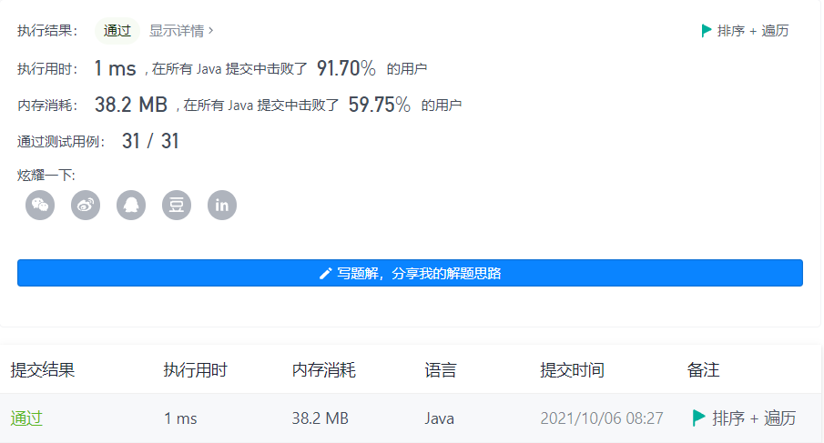
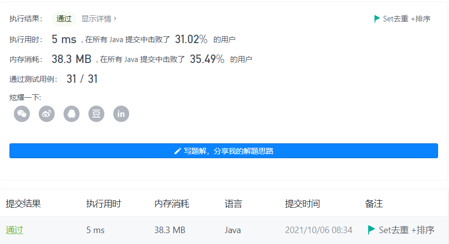
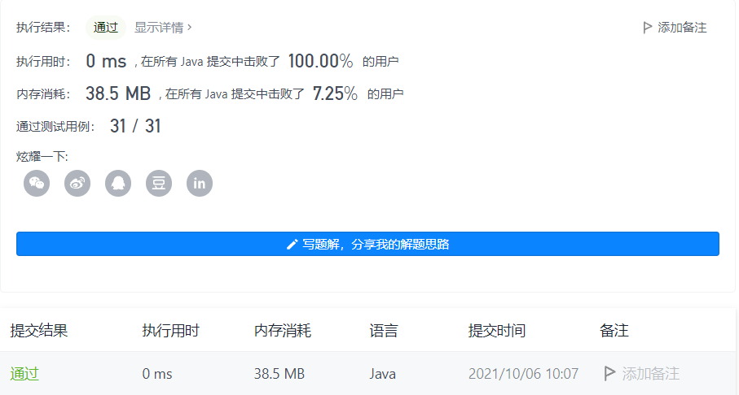

#### 414. 第三大的数

#### 2021-10-06 LeetCode每日一题

链接：https://leetcode-cn.com/problems/third-maximum-number/

标签：**数组、排序**

> 题目

给你一个非空数组，返回此数组中 第三大的数 。如果不存在，则返回数组中最大的数。

示例 1：

```java
输入：[3, 2, 1]
输出：1
解释：第三大的数是 1 。
```

示例 2：

```java
输入：[1, 2]
输出：2
解释：第三大的数不存在, 所以返回最大的数 2 。
```

示例 3：

```java
输入：[2, 2, 3, 1]
输出：1
解释：注意，要求返回第三大的数，是指在所有不同数字中排第三大的数。
此例中存在两个值为 2 的数，它们都排第二。在所有不同数字中排第三大的数为 1 。
```


提示：

- 1 <= nums.length <= 104
- -2 ^ 31 <= nums[i] <= 2 ^ 31 - 1


进阶：你能设计一个时间复杂度 O(n) 的解决方案吗？

> 分析

解法1：排序 + 遍历。这个时间复杂度就取决于排序算法了，遍历的时间复杂度是O(n).

解法2：Set去重 + 排序。

解法3：使用三个变量存放最大的数、第二大的数、第三大的数，遍历数组的过程中不断更新这三个数的值即可。注意题目给的num[i]的范围是[-2 ^ 32, 2 ^ 32 - 1]，所以三个变量的初始值不能是int的最小值，需要比int的最小值更小。

> 编码

解法1：

```java
class Solution {
    public int thirdMax(int[] nums) {
        Arrays.sort(nums);
        int count = 1;
        for (int i = nums.length - 1; i > 0; --i) {
            if (nums[i] != nums[i - 1]) {
                count++;
            }
            if (count == 3) {
                return nums[i - 1];
            }
        }

        return nums[nums.length - 1];
    }
}
```



解法2：

```java
class Solution {
    public int thirdMax(int[] nums) {
        // Set去重
        Set<Integer> set = new HashSet<>();
        for (int num : nums) {
            set.add(num);
        }

        List<Integer> list = new ArrayList<>(set);
        Collections.sort(list);
        return list.size() >= 3 ? list.get(list.size() - 3) : list.get(list.size() - 1); 
    }
}
```



时间复杂度：使用Set去重的时间复杂度为O(n)，排序的时间复杂度为O(n logn)，整体时间复杂度为O(n logn)。

空间复杂度为O(n)。

解法3：

```java
class Solution {
    public int thirdMax(int[] nums) {
        // a为最大值，b为第二大值，c为第三大值
        long a = Long.MIN_VALUE, b = Long.MIN_VALUE, c = Long.MIN_VALUE;
        for (int num : nums) {
            if (num > a) {
                c = b;
                b = a;
                a = num;
            } else if (num < a && num > b) {
                c = b;
                b = num;
            } else if (num < b && num > c) {
                c = num;
            }
        }

        return c == Long.MIN_VALUE ? (int)a : (int)c;
    }
}
```



时间复杂度O(n)，空间复杂度O(1)