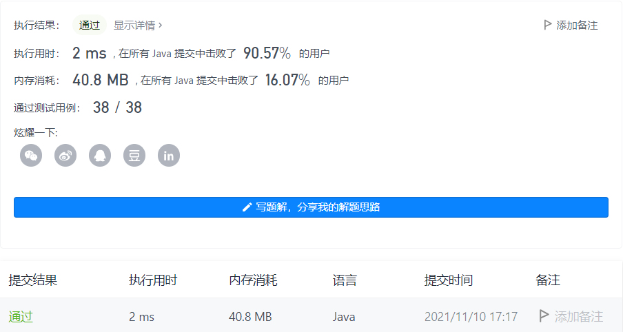

#### 495. 提莫攻击

#### 2021-11-10 LeetCode每日一题

链接：https://leetcode-cn.com/problems/teemo-attacking/

标签：**数组、模拟**

> 题目

在《英雄联盟》的世界中，有一个叫 “提莫” 的英雄。他的攻击可以让敌方英雄艾希（编者注：寒冰射手）进入中毒状态。

当提莫攻击艾希，艾希的中毒状态正好持续 duration 秒。

正式地讲，提莫在 t 发起发起攻击意味着艾希在时间区间 [t, t + duration - 1]（含 t 和 t + duration - 1）处于中毒状态。如果提莫在中毒影响结束 前 再次攻击，中毒状态计时器将会 重置 ，在新的攻击之后，中毒影响将会在 duration 秒后结束。

给你一个 非递减 的整数数组 timeSeries ，其中 timeSeries[i] 表示提莫在 timeSeries[i] 秒时对艾希发起攻击，以及一个表示中毒持续时间的整数 duration 。

返回艾希处于中毒状态的 总 秒数。


示例 1：

```java
输入：timeSeries = [1,4], duration = 2
输出：4
解释：提莫攻击对艾希的影响如下：

- 第 1 秒，提莫攻击艾希并使其立即中毒。中毒状态会维持 2 秒，即第 1 秒和第 2 秒。
- 第 4 秒，提莫再次攻击艾希，艾希中毒状态又持续 2 秒，即第 4 秒和第 5 秒。
  艾希在第 1、2、4、5 秒处于中毒状态，所以总中毒秒数是 4 。
```

示例 2：

```java
输入：timeSeries = [1,2], duration = 2
输出：3
解释：提莫攻击对艾希的影响如下：

- 第 1 秒，提莫攻击艾希并使其立即中毒。中毒状态会维持 2 秒，即第 1 秒和第 2 秒。
- 第 2 秒，提莫再次攻击艾希，并重置中毒计时器，艾希中毒状态需要持续 2 秒，即第 2 秒和第 3 秒。
  艾希在第 1、2、3 秒处于中毒状态，所以总中毒秒数是 3 。
```


提示：

- 1 <= timeSeries.length <= 10 ^ 4
- 0 <= timeSeries[i], duration <= 10 ^ 7
- timeSeries 按 非递减 顺序排列

> 分析

假设中毒总时间为ans

- 如果当前元素timeSeries[i]和下一元素timeSeries[i + 1]相隔的时间 > 中毒持续的时间duration，则ans直接加上duration即可。
- 反之，则ans + (timeSeries[i + 1] - timeSeries[i])，因为下一次中毒会刷新中毒时间。

循环结束后，注意还有一轮中毒。

> 编码

```java
class Solution {
    public int findPoisonedDuration(int[] timeSeries, int duration) {
        int ans = 0;
        for (int i = 0; i < timeSeries.length - 1; i++) {
            if (timeSeries[i] + duration <= timeSeries[i + 1]) {
                ans += duration;
            } else {
                ans += timeSeries[i + 1] - timeSeries[i];
            }
        }
        
        return ans + duration;
    }
}
```

