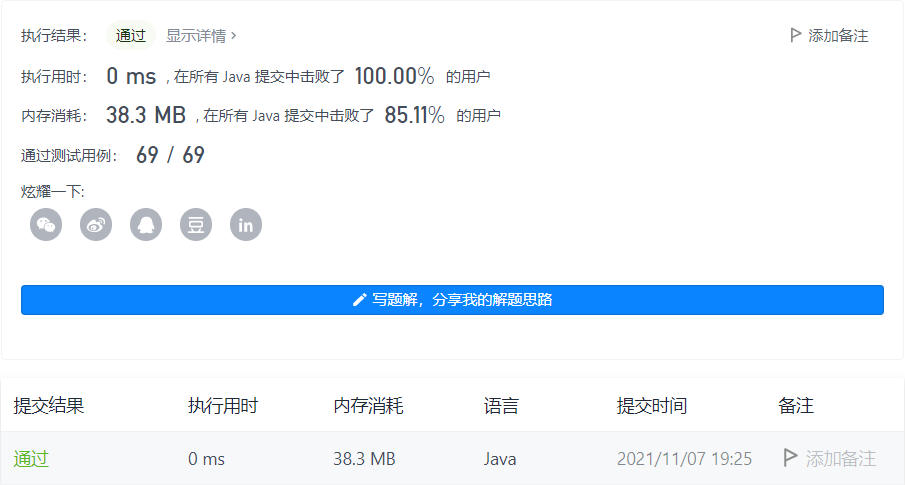

#### 598. 范围求和 II

#### 2021-11-07 LeetCode每日一题

链接：https://leetcode-cn.com/problems/range-addition-ii/

标签：**数组、数学**

> 题目

给定一个初始元素全部为 0，大小为 m*n 的矩阵 M 以及在 M 上的一系列更新操作。

操作用二维数组表示，其中的每个操作用一个含有两个正整数 a 和 b 的数组表示，含义是将所有符合 0 <= i < a 以及 0 <= j < b 的元素 M[i][j] 的值都增加 1。

在执行给定的一系列操作后，你需要返回矩阵中含有最大整数的元素个数。

示例 1:

```java
输入: 
m = 3, n = 3
operations = [[2,2],[3,3]]
输出: 4
解释: 
初始状态, M = 
[[0, 0, 0],
 [0, 0, 0],
 [0, 0, 0]]

执行完操作 [2,2] 后, M = 
[[1, 1, 0],
 [1, 1, 0],
 [0, 0, 0]]

执行完操作 [3,3] 后, M = 
[[2, 2, 1],
 [2, 2, 1],
 [1, 1, 1]]

M 中最大的整数是 2, 而且 M 中有4个值为2的元素。因此返回 4。
```

注意:

- m 和 n 的范围是 [1,40000]。
- a 的范围是 [1,m]，b 的范围是 [1,n]。
- 操作数目不超过 10000。

> 分析

可以知道，我们只需要找operations数组中最小的x和最小的y即可。因为大于x和大于y的操作，都会把x * y内的矩阵元素加1，所以最后最大的数肯定是x * y内的元素。

> 编码

```java
class Solution {
    public int maxCount(int m, int n, int[][] ops) {
        int x = m, y = n;
        for (int[] nums : ops) {
            if (nums[0] < x) {
                x = nums[0];
            }
            if (nums[1] < y) {
                y = nums[1];
            }
        }

        return x * y;
    }
}
```

