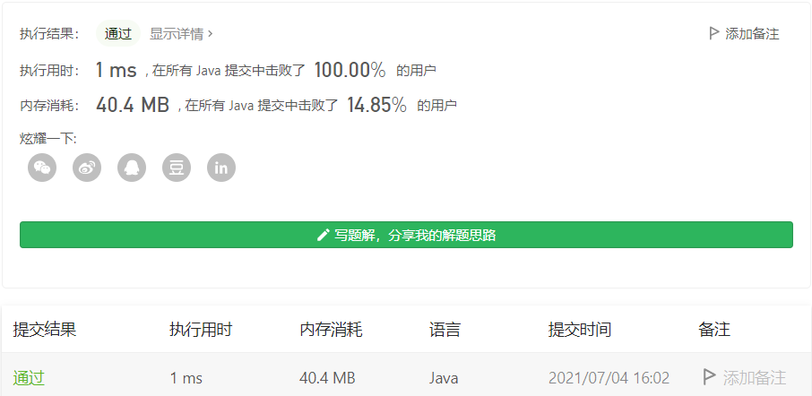
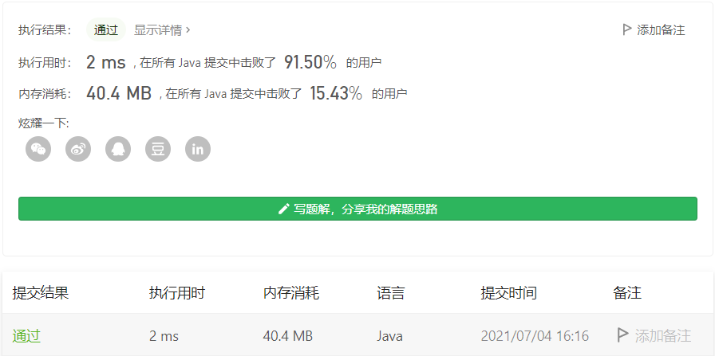

#### 645. 错误的集合

#### 2021-07-04 LeetCode每日一题

链接：https://leetcode-cn.com/problems/set-mismatch/

标签：**位运算、数组、哈希表、排序**

> 题目

集合 s 包含从 1 到 n 的整数。不幸的是，因为数据错误，导致集合里面某一个数字复制了成了集合里面的另外一个数字的值，导致集合 丢失了一个数字 并且 有一个数字重复 。

给定一个数组 nums 代表了集合 S 发生错误后的结果。

请你找出重复出现的整数，再找到丢失的整数，将它们以数组的形式返回。

示例 1：

```java
输入：nums = [1,2,2,4]
输出：[2,3]
```

示例 2：

```java
输入：nums = [1,1]
输出：[1,2]
```


提示：

- 2 <= nums.length <= 104
- 1 <= nums[i] <= 104

> 分析

方法1：用哈希表记录每个数字出现的次数，出现两次的数字和没有出现的数字就是我们要找的两个数。这里可以使用数组充当哈希表，提高效率。

方法2：对于给定数组[1, 2, 2, 4]，定义sum1 = sum([1, 2, 2, 4])，sum2 = sum([1, 2, 3, 4])，sum3 = sum([1, 2, 4])，那么可以知道出现两次的数字是sum1 - sum3，缺失的数字是sum2 - sum3

> 编码

**使用哈希表**：

```java
class Solution {
    public int[] findErrorNums(int[] nums) {
        int len = nums.length;
        int[] res = new int[2];
        int[] vals = new int[len + 1];

        for (int num : nums) {
            vals[num]++;
        }

        for (int i = 1; i <= len; i++) {
            if (vals[i] == 0) {
                res[1] = i;
            } else if (vals[i] == 2) {
                res[0] = i;
            }
        }

        return res;
    }
}
```



**使用数学方法**：

```java
class Solution {
    public int[] findErrorNums(int[] nums) {
        int len = nums.length;
        // 正确数组的和
        int oriSum = ((1 + len) * len) / 2;
        // 题目给定错误数组的和
        int errSum = 0;
        // 去掉一个重复数字的数组的和
        int sum = 0;
        int[] count = new int[len + 1];

        for (int i = 0; i < len; i++) {
            errSum += nums[i];
            if (count[nums[i]] == 0) {
                sum += nums[i];
            }
            count[nums[i]] = 1;
        }

        return new int[]{errSum - sum, oriSum - sum};
    }
}
```

