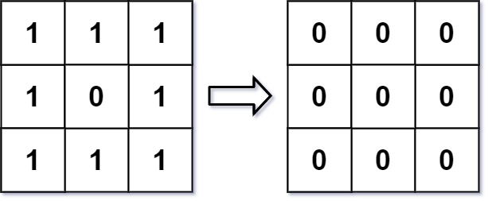

#### 661. 图片平滑器

#### 2022-03-24 LeetCode每日一题

链接：https://leetcode-cn.com/problems/image-smoother/

标签：**数组、矩阵**

> 题目

图像平滑器 是大小为 3 x 3 的过滤器，用于对图像的每个单元格平滑处理，平滑处理后单元格的值为该单元格的平均灰度。

每个单元格的  平均灰度 定义为：该单元格自身及其周围的 8 个单元格的平均值，结果需向下取整。（即，需要计算蓝色平滑器中 9 个单元格的平均值）。

如果一个单元格周围存在单元格缺失的情况，则计算平均灰度时不考虑缺失的单元格（即，需要计算红色平滑器中 4 个单元格的平均值）。


给你一个表示图像灰度的 m x n 整数矩阵 img ，返回对图像的每个单元格平滑处理后的图像 。

示例 1:



```java
输入:img = [[1,1,1],[1,0,1],[1,1,1]]
输出:[[0, 0, 0],[0, 0, 0], [0, 0, 0]]
解释:
对于点 (0,0), (0,2), (2,0), (2,2): 平均(3/4) = 平均(0.75) = 0
对于点 (0,1), (1,0), (1,2), (2,1): 平均(5/6) = 平均(0.83333333) = 0
对于点 (1,1): 平均(8/9) = 平均(0.88888889) = 0
```

示例 2:


```java
输入: img = [[100,200,100],[200,50,200],[100,200,100]]
输出: [[137,141,137],[141,138,141],[137,141,137]]
解释:
对于点 (0,0), (0,2), (2,0), (2,2): floor((100+200+200+50)/4) = floor(137.5) = 137
对于点 (0,1), (1,0), (1,2), (2,1): floor((200+200+50+200+100+100)/6) = floor(141.666667) = 141
对于点 (1,1): floor((50+200+200+200+200+100+100+100+100)/9) = floor(138.888889) = 138
```


提示:

- m == img.length
- n == img[i].length
- 1 <= m, n <= 200
- 0 <= img[i][j] <= 255

> 分析

其实就是以每个点为中心点，加上它周围8个点（如果存在的话）的总和，然后算出平均值，就是这个点的值。

> 编码

```java
class Solution {
    public int[][] imageSmoother(int[][] img) {
        int m = img.length, n = img[0].length;
        int[][] ans = new int[m][n];
        for (int i = 0; i < m; i++) {
            for (int j = 0; j < n; j++) {
                ans[i][j] = calcutor(img, i, j);
            }
        }

        return ans;
    }

    private int calcutor(int[][] img, int x, int y) {
        int sum = img[x][y], row = img.length, col = img[0].length;
        int count = 1;
        if (x - 1 >= 0) {
            sum += img[x - 1][y];
            count++;
            if (y - 1 >= 0) {
                sum += img[x - 1][y - 1];
                count++;
            }
            if (y + 1 < col) {
                sum += img[x - 1][y + 1];
                count++;
            }
        }
        if (x + 1 < row) {
            sum += img[x + 1][y];
            count++;
            if (y - 1 >= 0) {
                sum += img[x + 1][y - 1];
                count++;
            }
            if (y + 1 < col) {
                sum += img[x + 1][y + 1];
                count++;
            }
        }
        if (y - 1 >= 0) {
            sum += img[x][y - 1];
            count++;
        }
        if (y + 1 < col) {
            sum += img[x][y + 1];
            count++;
        }
        return (int)Math.floor(sum / count);
    }
}
```

