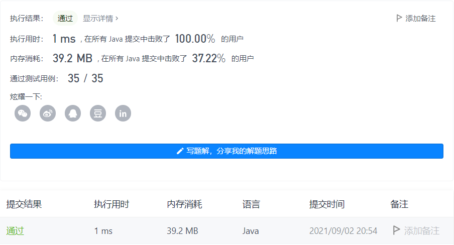

#### 674. 最长连续递增序列

链接：https://leetcode-cn.com/problems/longest-continuous-increasing-subsequence/

标签：**数组**

> 题目

给定一个未经排序的整数数组，找到最长且 连续递增的子序列，并返回该序列的长度。

连续递增的子序列 可以由两个下标 l 和 r（l < r）确定，如果对于每个 l <= i < r，都有 nums[i] < nums[i + 1] ，那么子序列 [nums[l], nums[l + 1], ..., nums[r - 1], nums[r]] 就是连续递增子序列。

示例 1：

```java
输入：nums = [1,3,5,4,7]
输出：3
解释：最长连续递增序列是 [1,3,5], 长度为3。
尽管 [1,3,5,7] 也是升序的子序列, 但它不是连续的，因为 5 和 7 在原数组里被 4 隔开。 
```

示例 2：

```java
输入：nums = [2,2,2,2,2]
输出：1
解释：最长连续递增序列是 [2], 长度为1。
```


提示：

- 1 <= nums.length <= 10 ^ 4
- -10 ^ 9 <= nums[i] <= 10 ^ 9

> 题目

根据提示，数组长度在[1, 10 ^ 4]，求最长的连续递增序列，只需要一次遍历，如果递增个数count就相加，不符合就比较当前的长度count和目前最大的长度，取最大值，然后count初始化重新开始累加即可。

> 编码

```java
class Solution {
    public int findLengthOfLCIS(int[] nums) {
        int res = 0, count = 1;
        for (int i = 1; i < nums.length; i++) {
            if (nums[i] > nums[i - 1]) {
                count++;
            } else {
                if (count > res) {
                    res = count;
                }
                count = 1;
            }
        }

        return res > count ? res : count;
    }
}
```

