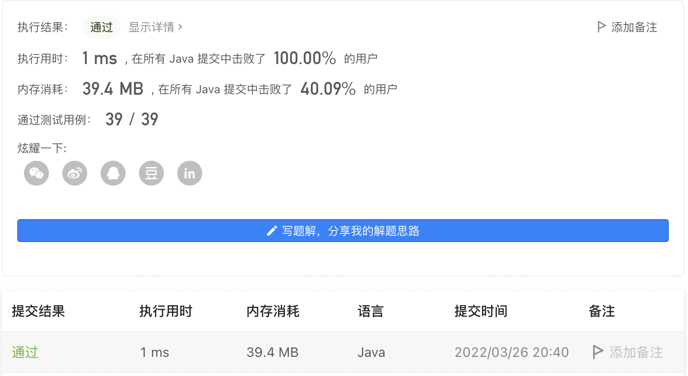
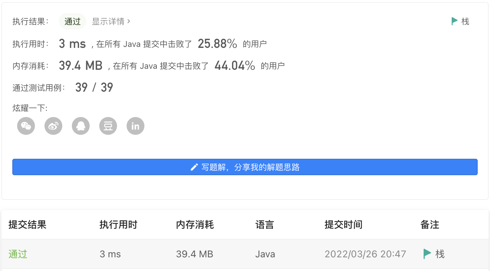

#### 682. 棒球比赛

#### 2022-03-26 LeetCode每日一题

链接：https://leetcode-cn.com/problems/baseball-game/

标签：**栈、数组、模拟**

> 题目

你现在是一场采用特殊赛制棒球比赛的记录员。这场比赛由若干回合组成，过去几回合的得分可能会影响以后几回合的得分。

比赛开始时，记录是空白的。你会得到一个记录操作的字符串列表 ops，其中 ops[i] 是你需要记录的第 i 项操作，ops 遵循下述规则：

- 整数 x - 表示本回合新获得分数 x
- "+" - 表示本回合新获得的得分是前两次得分的总和。题目数据保证记录此操作时前面总是存在两个有效的分数。
- "D" - 表示本回合新获得的得分是前一次得分的两倍。题目数据保证记录此操作时前面总是存在一个有效的分数。
- "C" - 表示前一次得分无效，将其从记录中移除。题目数据保证记录此操作时前面总是存在一个有效的分数。

请你返回记录中所有得分的总和。

示例 1：

```java
输入：ops = ["5","2","C","D","+"]
输出：30
解释：
"5" - 记录加 5 ，记录现在是 [5]
"2" - 记录加 2 ，记录现在是 [5, 2]
"C" - 使前一次得分的记录无效并将其移除，记录现在是 [5].
"D" - 记录加 2 * 5 = 10 ，记录现在是 [5, 10].
"+" - 记录加 5 + 10 = 15 ，记录现在是 [5, 10, 15].
所有得分的总和 5 + 10 + 15 = 30
```

示例 2：

```java
输入：ops = ["5","-2","4","C","D","9","+","+"]
输出：27
解释：
"5" - 记录加 5 ，记录现在是 [5]
"-2" - 记录加 -2 ，记录现在是 [5, -2]
"4" - 记录加 4 ，记录现在是 [5, -2, 4]
"C" - 使前一次得分的记录无效并将其移除，记录现在是 [5, -2]
"D" - 记录加 2 * -2 = -4 ，记录现在是 [5, -2, -4]
"9" - 记录加 9 ，记录现在是 [5, -2, -4, 9]
"+" - 记录加 -4 + 9 = 5 ，记录现在是 [5, -2, -4, 9, 5]
"+" - 记录加 9 + 5 = 14 ，记录现在是 [5, -2, -4, 9, 5, 14]
所有得分的总和 5 + -2 + -4 + 9 + 5 + 14 = 27
```

示例 3：

```java
输入：ops = ["1"]
输出：1
```


提示：

- 1 <= ops.length <= 1000
- ops[i] 为 "C"、"D"、"+"，或者一个表示整数的字符串。整数范围是 [-3 * 10 ^ 4, 3 * 10 ^ 4]
- 对于 "+" 操作，题目数据保证记录此操作时前面总是存在两个有效的分数
- 对于 "C" 和 "D" 操作，题目数据保证记录此操作时前面总是存在一个有效的分数

> 分析

解法1：可以使用一个数组保存每个回合的得分，最后相加即可。

解法2：这种后进先出，很适合用栈去解决。

> 编码

解法1:

```java
class Solution {
    public int calPoints(String[] ops) {
        int sum = 0, count = 0;
        int[] val = new int[ops.length];

        for (int i = 0; i < ops.length; i++) {
            if ("+".equals(ops[i])) {
                val[count] = val[count - 1] + val[count - 2];
            } else if ("D".equals(ops[i])) {
                val[count] = val[count - 1] * 2;
            } else if ("C".equals(ops[i])) {
                val[count - 1] = 0;
                count--;
                continue;
            } else {
                val[count] = Integer.valueOf(ops[i]);
            }
            count++;
        }

        for (int i = 0; i < ops.length; i++) {
            sum += val[i];
        }

        return sum;
    }
}
```



时间复杂度O(N)，空间复杂度O(N)。N为数组长度。

解法2:

```java
class Solution {
    public int calPoints(String[] ops) {
        int sum = 0;
        Stack<Integer> stack = new Stack<>();

        for (int i = 0; i < ops.length; i++) {
            if ("+".equals(ops[i])) {
                Integer num1 = stack.pop();
                Integer num2 = stack.pop();
                Integer num = num1 + num2;
                stack.push(num2);
                stack.push(num1);
                stack.push(num);
            } else if ("D".equals(ops[i])) {
                stack.push(stack.peek() * 2);
            } else if ("C".equals(ops[i])) {
                stack.pop();
            } else {
                stack.push(Integer.valueOf(ops[i]));
            }
        }

        while (!stack.empty()) {
            sum += stack.pop();
        }

        return sum;
    }
}
```

