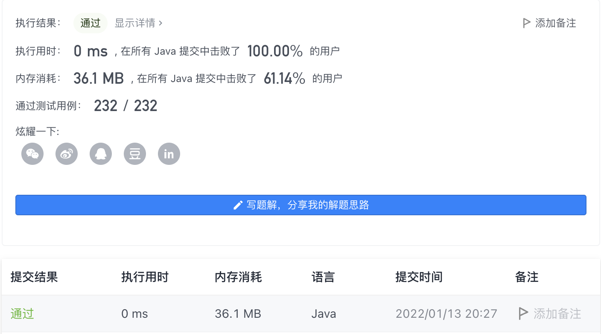

#### 747. 至少是其他数字两倍的最大数

#### 2022-01-13 LeetCode每日一题

链接：https://leetcode-cn.com/problems/largest-number-at-least-twice-of-others/

标签：**数组、排序**

> 题目

给你一个整数数组 nums ，其中总是存在 唯一的 一个最大整数 。

请你找出数组中的最大元素并检查它是否 至少是数组中每个其他数字的两倍 。如果是，则返回 最大元素的下标 ，否则返回 -1 。

示例 1：	

```java
输入：nums = [3,6,1,0]
输出：1
解释：6 是最大的整数，对于数组中的其他整数，6 大于数组中其他元素的两倍。6 的下标是 1 ，所以返回 1 。
```

示例 2：

```java
输入：nums = [1,2,3,4]
输出：-1
解释：4 没有超过 3 的两倍大，所以返回 -1 。
```

示例 3：

```java
输入：nums = [1]
输出：0
解释：因为不存在其他数字，所以认为现有数字 1 至少是其他数字的两倍。
```


提示：

- 1 <= nums.length <= 50
- 0 <= nums[i] <= 100
- nums 中的最大元素是唯一的

> 分析

因为要返回下标，所以不能在排序后去拿最大值，至少要先拿到最大值的下标后再排序。另外考虑最大值至少是数组中每个数字的2倍，那么最大值只需要是第二大数的2倍以上，自然也是其他数的2倍以上。所以只需要一次遍历找到最大值和第二大的值，同时记录最大值的下标，最后判断最大值是不是次大值的2倍以上，如果是返回下标，否则返回-1。

> 编码

```java
class Solution {
    public int dominantIndex(int[] nums) {
        // first表示最大的数，second表示第二大的数
        int first = nums[0], second = -1, index = 0;
        for (int i = 1; i < nums.length; i++) {
            if (nums[i] >= first) {
                second = first;
                first = nums[i];
                index = i;
            } else if (nums[i] >= second) {
                second = nums[i];
            }
        }

        return first >= (2 * second) ? index : -1;
    }
}
```

