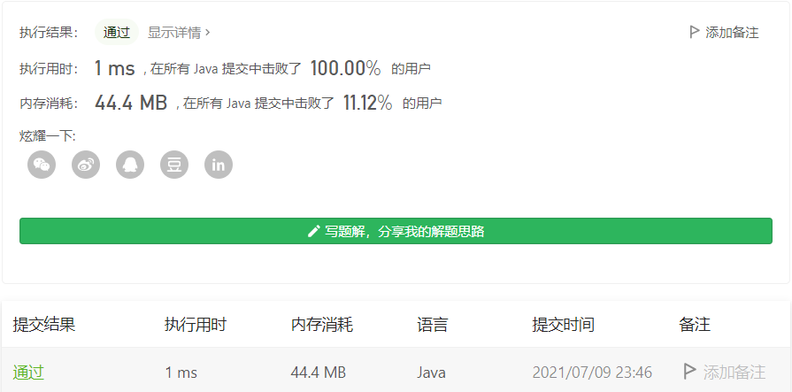

#### 面试题 17.10. 主要元素

#### 2021-07-09 LeetCode每日一题

链接：https://leetcode-cn.com/problems/find-majority-element-lcci/

标签：**数组、计数**

> 题目

数组中占比超过一半的元素称之为主要元素。给你一个 整数 数组，找出其中的主要元素。若没有，返回 -1 。请设计时间复杂度为 O(N) 、空间复杂度为 O(1) 的解决方案。

**示例 1：**

```
输入：[1,2,5,9,5,9,5,5,5]
输出：5
```

**示例 2：**

```
输入：[3,2]
输出：-1
```

**示例 3：**

```
输入：[2,2,1,1,1,2,2]
输出：2
```

> 分析

如果题目不要求使用O(1)空间复杂度那还比较好说，直接使用哈希表进行统计即可。

```java
class Solution {
    public int majorityElement(int[] nums) {
        Map<Integer, Integer> map = new HashMap<>();

        for (int i = 0; i < nums.length; i++) {
            map.put(nums[i], map.getOrDefault(nums[i], 0) + 1);
            if (map.get(nums[i]) > nums.length / 2) {
                return nums[i];
            }
        }

        return -1;
    }
}
```

但这题要求空间复杂度是O(1)，所以这里使用**摩尔投票法**解决。关于摩尔投票法，可以看[这篇文章](https://github.com/stronglxp/learnNote/blob/main/leetcode/%E8%A7%A3%E9%A2%98%E6%96%B9%E6%B3%95%E6%80%BB%E7%BB%93/%E4%BD%BF%E7%94%A8%E6%91%A9%E5%B0%94%E6%8A%95%E7%A5%A8%E6%B3%95%E8%A7%A3%E5%86%B3%E6%B1%82%E5%A4%9A%E6%95%B0%E9%97%AE%E9%A2%98.md)。

> 编码

```java
class Solution {
    public int majorityElement(int[] nums) {
        int major = 0, count = 0;
        for (int i = 0; i < nums.length; i++) {
            if (count == 0) {
                major = nums[i];
            }
            if (major == nums[i]) {
                count++;
            } else {
                count--;
            }
        }

        count = 0;
        // 再循环一遍，确定major的出现次数是否符合条件。因为题目说可能不存在主要元素
        // 所以对于[1, 2, 3]这样不存在主要元素的奇数个数序列，需要进行二次遍历
        for (int num : nums) {
            if (num == major) {
                count++;
            }
        }

        return (count <= nums.length / 2) ? -1 : major;
    }
}
```

