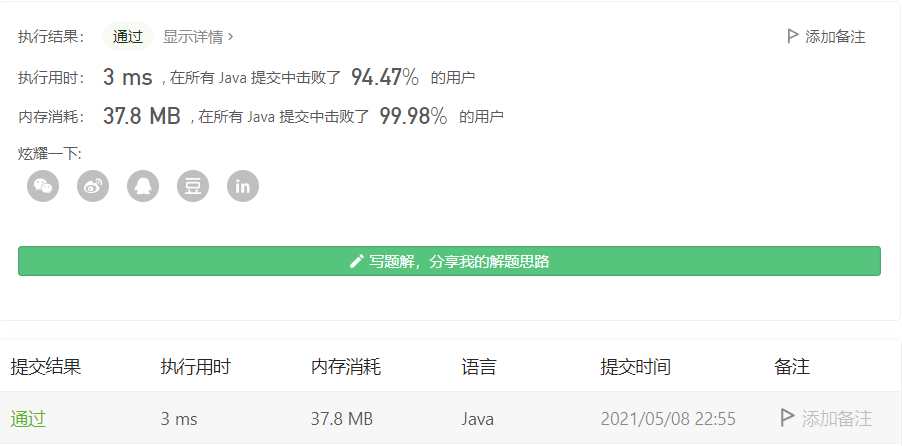
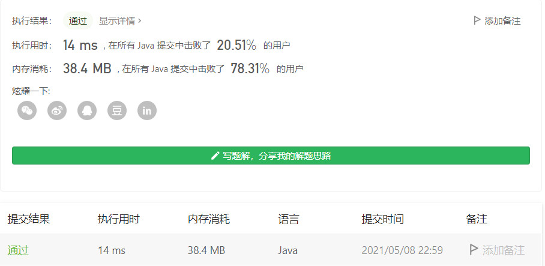

#### 3. 无重复字符的最长子串

链接：https://leetcode-cn.com/problems/longest-substring-without-repeating-characters/

> 题目

给定一个字符串，请你找出其中不含有重复字符的 **最长子串** 的长度。

```java
输入: "abcabcbb"
输出: 3 
解释: 因为无重复字符的最长子串是 "abc"，所以其长度为 3。
    
输入: "bbbbb"
输出: 1
解释: 因为无重复字符的最长子串是 "b"，所以其长度为 1。
    
输入: "pwwkew"
输出: 3
解释: 因为无重复字符的最长子串是 "wke"，所以其长度为 3。
     请注意，你的答案必须是 子串 的长度，"pwke" 是一个子序列，不是子串。
    
输入: s = ""
输出: 0

0 <= s.length <= 5 * 104
s 由英文字母、数字、符号和空格组成
```

这题可以用**滑动窗口**来解决，也用到了双指针。在字符串s中寻找最长的目标子串t

滑动窗口的大致流程如下：

（1）在原始字符串s中使用双指针，初始化left = right = 0，[left, right]称之为一个窗口。

（2）不断增加right扩大窗口，直到窗口中包含t的所有字符。

（3）此时，停止增加right，增加left指针缩小窗口，直到窗口中不包含t的所有字符。每次增加left，记得更新结果。

（4）重复（2）和（3）两步，直到right到达字符串s的结尾。

**方法一：使用数组来做窗口**

```java
class Solution {
    public int lengthOfLongestSubstring(String s) {
        // windows存放子串并记录每个字符出现的次数
        int[] windows = new int[128];
        int left = 0, right = 0, len = s.length(), res = 0;
        char[] chs = s.toCharArray();

        while (right < len) {
            // 窗口往右滑动扩大
            char c = chs[right++];
            windows[c]++;

            // 子串出现相同的字符，说明窗口需要向右滑动缩小，直到子串里没有相同的字符
            while (windows[c] > 1) {
                char d = chs[left++];
                windows[d]--;
            }

            // 更新当前符合条件的子串长度
            res = Math.max(res, right - left);
        }

        return res;
    }
}
```



**方法二：使用Map来做窗口**

```java
class Solution {
    /**
     * 滑动窗口 
     */
    public int lengthOfLongestSubstring(String s) {
        // windows存放子串并记录每个字符出现的次数
        Map<Character, Integer> windows = new HashMap<>();
        int left = 0, right = 0, res = 0, len = s.length();
        char[] chs = s.toCharArray();

        while (right < len) {
            // 窗口往右滑动扩大
            char c = chs[right++];
            windows.put(c, windows.getOrDefault(c, 0) + 1);

            // 子串出现相同的字符，说明窗口需要向右滑动缩小，直到子串里没有相同的字符
            while (windows.get(c) > 1) {
                char d = chs[left++];
                windows.put(d, windows.get(d) - 1);
            }

            // 更新当前符合条件的子串长度
            res = Math.max(res, right - left);
        }

        return res;
    }
}
```



**可以发现使用数组做窗口，比使用Map来做窗口，在时间和空间上，都有提升。**