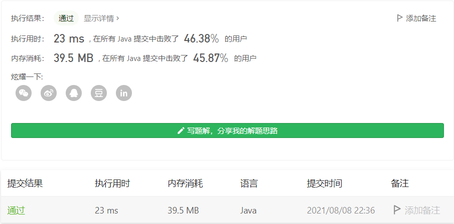

#### 438. 找到字符串中所有字母异位词

链接：https://leetcode-cn.com/problems/find-all-anagrams-in-a-string/

标签：**哈希表、字符串、滑动窗口**

> 题目

给定两个字符串 s 和 p，找到 s 中所有 p 的 异位词 的子串，返回这些子串的起始索引。不考虑答案输出的顺序。

异位词 指字母相同，但排列不同的字符串。

示例 1:

```java
输入: s = "cbaebabacd", p = "abc"
输出: [0,6]
解释:
起始索引等于 0 的子串是 "cba", 它是 "abc" 的异位词。
起始索引等于 6 的子串是 "bac", 它是 "abc" 的异位词。
```

 示例 2:

```java
输入: s = "abab", p = "ab"
输出: [0,1,2]
解释:
起始索引等于 0 的子串是 "ab", 它是 "ab" 的异位词。
起始索引等于 1 的子串是 "ba", 它是 "ab" 的异位词。
起始索引等于 2 的子串是 "ab", 它是 "ab" 的异位词。
```


提示:

- 1 <= s.length, p.length <= 3 * 10 ^ 4
- s 和 p 仅包含小写字母

> 分析

滑动窗口无疑。相当于在s中找p的所有全排列，记录下标即可。还是需要注意的是，Integer类型比较两个数相等最好用`equals`方法更保险。

> 编码

```java
class Solution {
    public List<Integer> findAnagrams(String s, String p) {
        List<Integer> res = new ArrayList<>();
        Map<Character, Integer> need = new HashMap<>();
        // 目标字符
        for (char c : p.toCharArray()) {
            need.put(c, need.getOrDefault(c, 0) + 1);
        }
        int valid = 0;
        // 窗口
        Map<Character, Integer> window = new HashMap<>();
        char[] chs = s.toCharArray();
        int left = 0, right = 0, len = s.length();

        while (right < len) {
            char c = chs[right++];
            // 如果包含目标字符，则放入窗口
            if (need.containsKey(c)) {
                window.put(c, window.getOrDefault(c, 0) + 1);
                // 字符出现的次数等于目标字符出现的次数
                if (window.get(c).equals(need.get(c))) {
                    valid++;
                }
            }

            // 收缩窗口
            while (right - left >= p.length()) {
                // 找到一个异位词
                if (valid == need.size()) {
                    res.add(left);
                }
                c= chs[left++];
                if (need.containsKey(c)) {
                    Integer num = window.get(c);
                    if (need.get(c).equals(num)) {
                        valid--;
                    }
                    if (num != null && num > 0) {
                        window.put(c, num - 1);
                    }
                }
            }
        }
        return res;
    }
}
```

