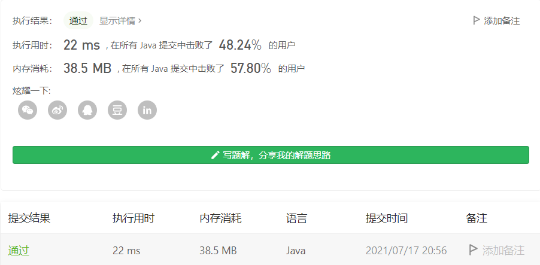

#### 567. 字符串的排列

链接：https://leetcode-cn.com/problems/permutation-in-string/

标签：**字符串、哈希表、双指针、滑动窗口**

> 题目

给定两个字符串 `s1` 和 `s2`，写一个函数来判断 `s2` 是否包含 `s1` 的排列。

换句话说，第一个字符串的排列之一是第二个字符串的 **子串** 。

示例 1：

```java
输入: s1 = "ab" s2 = "eidbaooo"
输出: True
解释: s2 包含 s1 的排列之一 ("ba").
```

示例 2：

```java
输入: s1= "ab" s2 = "eidboaoo"
输出: False
```


提示：

- 1 <= s1.length, s2.length <= 104
- s1 和 s2 仅包含小写字母

> 分析

一看就是用滑动窗口做。第一个字符串的排列之一是第二个字符串的 **子串** 。

具体做法不说了，可以参考之前的题解，这里我可以**使用数组做窗口，也可以使用map做窗口**，但要强调的是：如果使用map做窗口，那么值的类型是Integer，在判断的时候相等的时候，要使用**`equals`方法进行判断，因为在[-128, 127]范围内，Integer是从缓存中拿值，所以使用==进行判断也是对的，但在这个范围之外，是两个不同的对象，使用==判断必然为false，应该地址不一样，所以需要使用`equals`方法判断值相等**。

找这个bug找了一小时。。我吐了。

> 编码

```java
class Solution {
    public boolean checkInclusion(String s1, String s2) {
        Map<Character, Integer> need = new HashMap<>();
        for (char c : s1.toCharArray()) {
            need.put(c, need.getOrDefault(c, 0) + 1);
        }

        Map<Character, Integer> window = new HashMap<>();
        char[] chs = s2.toCharArray();
        int left = 0, right = 0, valid = 0;
        while (right < s2.length()) {
            char c = chs[right];
            // 扩大窗口
            right++;
            if (need.containsKey(c)) {
                window.put(c, window.getOrDefault(c, 0) + 1);
                if (window.get(c).equals(need.get(c))) {
                    // 找到了一个字符（数量也相等）
                    valid++;
                }
            }

            // 窗口长度大于等于s1的长度，收缩窗口
            while (right - left >= s1.length()) {
                // 找到了一个排列
                if (valid == need.size()) {
                    return true;
                }

                c = chs[left];
                left++;
                // 改变窗口中的内容
                if (need.containsKey(c)) {
                    Integer num = window.get(c);
                    // 使用equals比较相等，Integer在[-128, 127]范围可以使用==
                    if (need.get(c).equals(num)) {
                        valid--;
                    }
                    if (num != null && num > 0) {
                        window.put(c, num - 1);
                    }
                }
            }
        }

        return false;
    }
}
```

