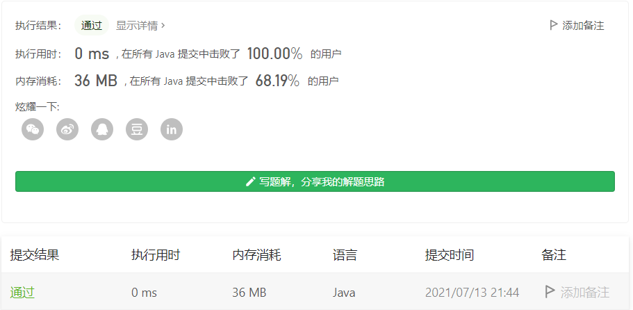
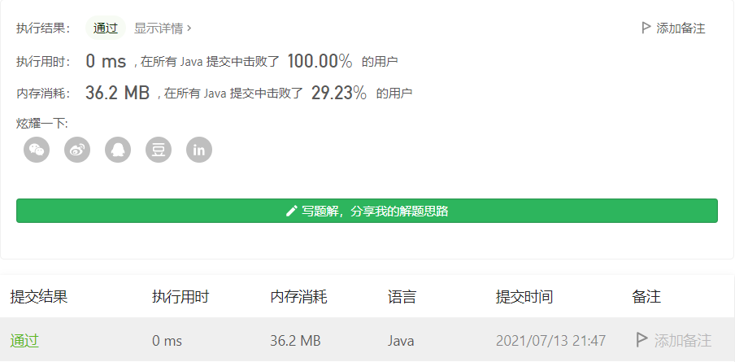
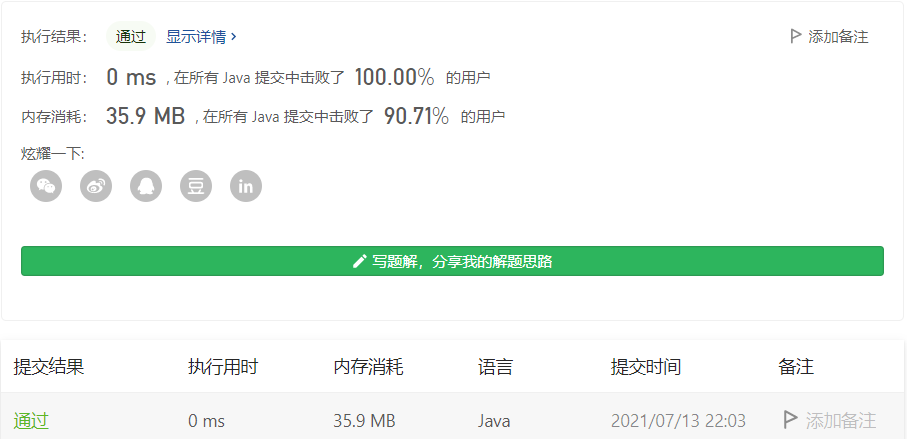

#### 面试题 01.01. 判定字符是否唯一

链接：https://leetcode-cn.com/problems/is-unique-lcci/

标签：**位运算、哈希表、字符串、排序**

> 题目

实现一个算法，确定一个字符串 `s` 的所有字符是否全都不同。

示例 1：

```java
输入: s = "leetcode"
输出: false 
```

示例 2：

```java
输入: s = "abc"
输出: true
```

限制：

- 0 <= len(s) <= 100
- 如果你不使用额外的数据结构，会很加分。

> 分析

先借用评论区的一段话

```txt
如果我是面试官，我会希望看到什么？

可能有点偏题，毕竟这里主要就是做题的地方。。

如果我是面试官，会考虑主要考察什么，就我的工作经验看，大多数主要是招聘工程师的，面试者如果什么问题都没有，直接写个二重循环搞定，会首先给个50分，如果能写点判断字符串是否为null的，60分。

直接上手什么bitset，什么位运算的，我会先问他，题目中有没有交代字符串的字符一定是26个英文字母？如果是unicode环境，你是不是要准备2^16/8个字节的空间？在实际项目中，风险可控，结果可期更重要，绝大多数时候不在乎那点时间和资源。

所以我期望面试者不要急于解答，我希望他先问我问题：

(1)字符串的字符范围，如果我告诉他，26个小写英文字母，那可能一开头直接判断如果字符长度>26, 直接返回False，做到这一点的，80分
(2)如果我告诉他ascii字符集，然后他的代码里有边界检查，并且针对不同的范围有不同的侧重点，比如说ascii字符集，那也就是128个可能性，16个字节的位运算比较好
(3)如果我告诉他是unicode，没有字符范围，老老实实排序再判断是比较符合我对工程师的要求的，因为算法性能稳定，没有额外资源要求，一眼看出没什么不可预见的风险，100分。

就是说，有些东西，没想到或者一时没想到根本不是问题，日常工作中稍微提示一下即可，但是缜密的思维对于程序员来说更重要。
```

这题方法有很多。

> 编码

**排序 + 循环**

```java
class Solution {
    public boolean isUnique(String astr) {
        char[] chs = astr.toCharArray();
        Arrays.sort(chs);

        for (int i = 0; i < chs.length - 1; i++) {
            if (chs[i] == chs[i + 1]) {
                return false;
            }
        }

        return true;
    }
}
```



**下标数组**

```java
class Solution {
    public boolean isUnique(String astr) {
        boolean[] val = new boolean[128];

        for (int i = 0; i < astr.length(); i++) {
            char c = astr.charAt(i);
            if (val[c]) {
                return false;
            }
            val[c] = true;
        }

        return true;
    }
}
```



位运算

```java
class Solution {
    public boolean isUnique(String astr) {
        int mask = 0;
        for (char c : astr.toCharArray()) {
            int temp = (1 << (c - 'a'));
            if (mask == (mask | temp)) {
                return false;
            }
            mask |= temp;
        }

        return true;
    }
}
```

