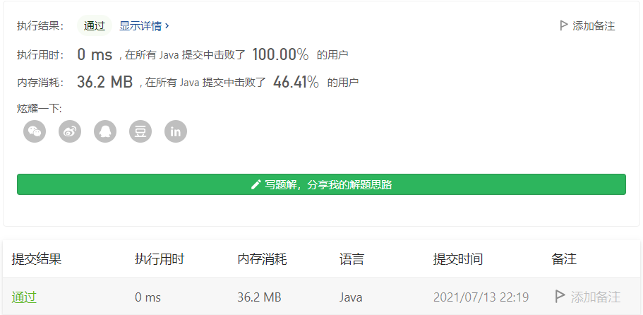

#### 面试题 01.02. 判定是否互为字符重排

链接：https://leetcode-cn.com/problems/check-permutation-lcci/

标签：**哈希表、字符串、排序**

> 题目

给定两个字符串 `s1` 和 `s2`，请编写一个程序，确定其中一个字符串的字符重新排列后，能否变成另一个字符串。

**示例 1：**

```
输入: s1 = "abc", s2 = "bca"
输出: true 
```

**示例 2：**

```
输入: s1 = "abc", s2 = "bad"
输出: false
```

**说明：**

- `0 <= len(s1) <= 100`
- `0 <= len(s2) <= 100`

> 分析

先判断两个字符串的长度是否相等，如果不相等，那么直接就返回true。一个字符串重新排列后能变成另一个字符串，那么这两个字符串包含的各个字符数量肯定都是相等的，只是顺序可能不同。所以有以下几种思路解决：

（1）对两个字符串先排序，再逐个对比字符是否相等，不相等直接返回false。

（2）不排序，用下标数组先遍历第一个字符进行累加，然后再遍历另一个字符累减，看看最后是否回到原状态。

> 编码

**先排序再比较**

```java
class Solution {
    public boolean CheckPermutation(String s1, String s2) {
        // 长度不相等，直接返回false 
        if (s1.length() != s2.length()) {
            return false;
        }

        char[] c1 = s1.toCharArray();
        char[] c2 = s2.toCharArray();
        Arrays.sort(c1);
        Arrays.sort(c2);

        for (int i = 0; i < c1.length; i++) {
            if (c1[i] != c2[i]) {
                return false;
            }
        }

        return true;
    }
}
```



**下标数组**

```java
class Solution {
    public boolean CheckPermutation(String s1, String s2) {
        // 长度不相等，直接返回false 
        if (s1.length() != s2.length()) {
            return false;
        }

        byte[] val = new byte[128];
        for (char c : s1.toCharArray()) {
            val[c]++;
        }

        for (char c : s2.toCharArray()) {
            val[c]--;
            if (val[c] < 0) {
                return false;
            }
        }

        return true;
    }
}
```

