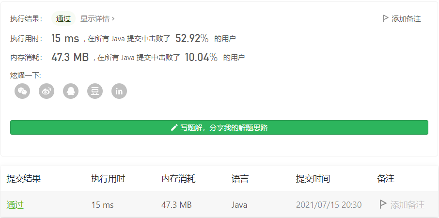

#### 面试题 01.03. URL化

链接：https://leetcode-cn.com/problems/string-to-url-lcci/

标签：**字符串**

> 题目

URL化。编写一种方法，将字符串中的空格全部替换为%20。假定该字符串尾部有足够的空间存放新增字符，并且知道字符串的“真实”长度。（注：用Java实现的话，请使用字符数组实现，以便直接在数组上操作。）

示例 1：

```java
输入："Mr John Smith    ", 13
输出："Mr%20John%20Smith"
```

示例 2：

```java
输入："               ", 5
输出："%20%20%20%20%20"
```


提示：

- 字符串长度在 [0, 500000] 范围内。

> 分析

这题没有多想，遍历替换就行了。

> 编码

```java
class Solution {
    public String replaceSpaces(String S, int length) {
        char[] chs = S.toCharArray();
        StringBuilder sb = new StringBuilder();

        for (int i = 0; i < length; i++) {
            if (chs[i] == ' ') {
                sb.append("%20");
            } else {
                sb.append(chs[i]);
            }
        }

        return sb.toString();
    }
}
```

