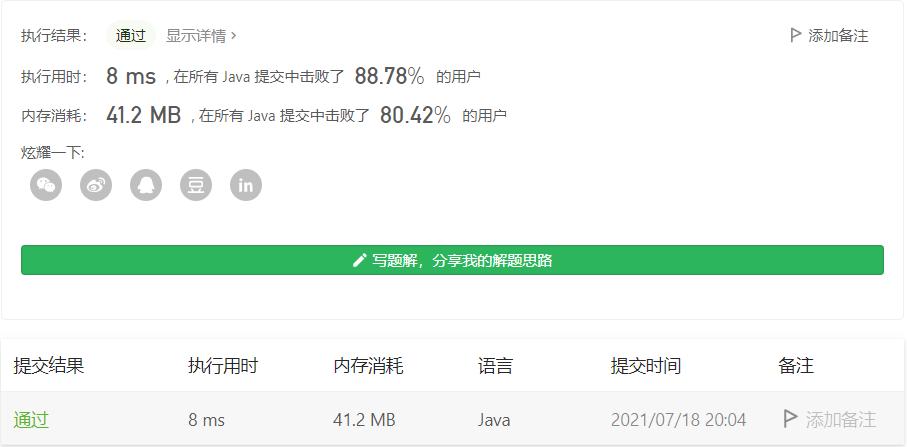

#### 面试题 10.02. 变位词组

#### 2021-07-18 LeetCode每日一题

链接：https://leetcode-cn.com/problems/group-anagrams-lcci/

标签：**哈希表、字符串、排序**

> 题目

编写一种方法，对字符串数组进行排序，将所有变位词组合在一起。变位词是指字母相同，但排列不同的字符串。

注意：本题相对原题稍作修改

示例:

```java
输入: ["eat", "tea", "tan", "ate", "nat", "bat"],
输出:
[
  ["ate","eat","tea"],
  ["nat","tan"],
  ["bat"]
]
```

说明：

- 所有输入均为小写字母。
- 不考虑答案输出的顺序。

> 分析

把字符串排序后作为键，存入哈希表，排序后相同的字符串放到一个链表里作为值即可。

> 编码

```java
class Solution {
    public List<List<String>> groupAnagrams(String[] strs) {
        Map<String, List<String>> map = new HashMap<>();
        for (int i = 0; i < strs.length; i++) {
            char[] chs = strs[i].toCharArray();
            Arrays.sort(chs);
            String key = new String(chs);
            List<String> val = map.getOrDefault(key, new ArrayList<String>());
            val.add(strs[i]);
            map.put(key, val);
        }

        List<List<String>> list = new ArrayList<>();
        for (Map.Entry<String, List<String>> entry : map.entrySet()) {
            list.add(entry.getValue());
        }

        return list;
    }
}
```

