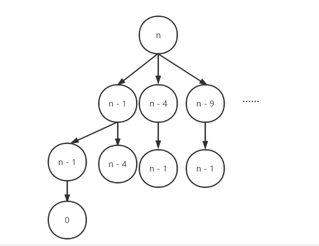

#### 279. 完全平方数

#### 2021-06-11 LeetCode每日一题

链接：https://leetcode-cn.com/problems/perfect-squares/

标签：**广度优先搜索、数学、动态规划、完全背包问题**

> 题目

给定正整数 n，找到若干个完全平方数（比如 1, 4, 9, 16, ...）使得它们的和等于 n。你需要让组成和的完全平方数的个数最少。

给你一个整数 n ，返回和为 n 的完全平方数的 最少数量 。

完全平方数 是一个整数，其值等于另一个整数的平方；换句话说，其值等于一个整数自乘的积。例如，1、4、9 和 16 都是完全平方数，而 3 和 11 不是。

```java
输入：n = 12
输出：3 
解释：12 = 4 + 4 + 4
    
输入：n = 13
输出：2
解释：13 = 4 + 9
    
1 <= n <= 104
```

> 分析

这题解法有好多，容易想到的就是BFS和完全背包。

（1）**BFS解法**：可以把所有的数想成一颗多叉树，n为根节点，每个数减去所有可能的平方数得到的差值作为它的子节点，如此下去，最先为0的数所在的层数即我们所需要的的答案。



BFS就是常规的BFS，但是在这个过程中需要进行剪枝，去掉一些重复走过的数字，不然可能超时。**选择一个合适的数据结构**也很重要，比如我一开始打算使用List来存放走过的节点，在这过程中需要判断节点是否存在List中，如果不存在，则加入List，但很无奈，在一些测试数据上，它超时了，比如9999这个测试数据。


后来想想，用一个boolean数组去存不是更快吗？用下标只需要O(1)的时间复杂度，果不其然，带来了质的飞跃。所以在做题的时候，**选择一个合适的数据结构也很重要**。

（2）**完全背包问题**：这题可以把n当做背包的总容量，把完全平方数当做物品的重量，题目就转换为，用最少的物品放满背包，物品可以重复选择。这就是一个典型的完全背包问题了。

定义**dp[i] 表示当背包容量为i时，放满背包的最少物品数量**。

- 对于任意容量i，dp[i]初始值为i，即最坏的情况，装i个重量为1 * 1的物品。
- 如果当前重量为num的物品能够装入背包，则dp[i] = dp[i - num] +1，如果不能装入背包，则dp[i] = dp[i]。所以dp[i] = min(dp[i - num] + 1, dp[i])
- 最终结果为dp[n]

（3）**数学法**。即四平方定理：**任何一个正整数都可以表示成不超过4个整数的平方之和**。（这解法估计大部分人都不知道。。）


- 所以答案只能是[1, 2, 3, 4]中的一个。
- 如果一个数可以表示成4个整数的平方和，那么这个数一定满足公式 n = (4^a)*(8b+7)
- 如果一个是本身就是完全平方数，那么答案就是1。
- 如果答案是2，那么n = a ^ 2 + b ^ 2，那么可以枚举a进行验证
- 剩下的答案就是3,

> 编码

**BFS**：

```java
class Solution {
    public int numSquares(int n) {
        Queue<Integer> queue = new LinkedList<>();
        queue.offer(n);
        int res = 0;
        // 记录已经走过的数
        boolean[] visited = new boolean[n + 1];

        while (!queue.isEmpty()) {
            int size = queue.size();
            for (int i = 0; i < size; i++) {
                int count = 1;
                int num = queue.poll();
                if (num == 0) {
                    return res;
                }

                for (int j = 1; j <= n; j = count * count) {
                    count++;
                    if (num >= j && !visited[num - j]) {
                        visited[num - j] = true;
                        queue.offer(num - j);
                    }
                }
            }
            res++;
        }

        return -1;
    }
}
```


**完全背包问题**：

```java
class Solution {
    public int numSquares(int n) {
        int[] dp = new int[n + 1];
        for (int i = 1; i <= n; i++) {
            // 初始化为i，即最坏的情况，全部装入重量为1的物品
            dp[i] = i;
            for (int j = 1; i - (j * j) >= 0; j++) {
                dp[i] = Math.min(dp[i - (j * j)] + 1, dp[i]);
            }
        }

        return dp[n];
    }
}
```


**数学法**：

```java
class Solution {
    public int numSquares(int n) {
        // 根据公式 n = (4^a)*(8b+7)缩小n
        while (n % 4 == 0) {
            n /= 4;
        }
        // 如果满足公式，则返回
        if (n % 8 == 7) {
            return 4;
        }

        // 判断缩小后的数是否可以由一个数的平方或者两个数的平方和组成
        int a = 0;
        while ((a * a) <= n) {
            int b = (int)Math.sqrt(n - a * a);
            if (a * a + b * b == n) {
                if (a != 0 && b != 0) {
                    return 2;
                } else {
                    return 1;
                }
            }
            a++;
        }
        return 3;
    }
}
```


