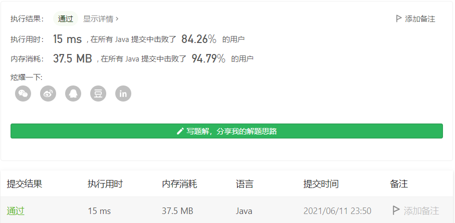

#### 322. 零钱兑换

链接：https://leetcode-cn.com/problems/coin-change/

标签：**动态规划、完全背包问题、广度优先搜索**

> 题目

给定不同面额的硬币 coins 和一个总金额 amount。编写一个函数来计算可以凑成总金额所需的最少的硬币个数。如果没有任何一种硬币组合能组成总金额，返回 -1。

你可以认为每种硬币的数量是无限的。

```java
输入：coins = [1, 2, 5], amount = 11
输出：3 
解释：11 = 5 + 5 + 1
    
输入：coins = [2], amount = 3
输出：-1
    
输入：coins = [1], amount = 0
输出：0
    
输入：coins = [1], amount = 1
输出：1
    
输入：coins = [1], amount = 2
输出：2
    
1 <= coins.length <= 12
1 <= coins[i] <= 231 - 1
0 <= amount <= 104
```

> 分析

此题和LeetCode第279题大致一样，可以参考[这篇题解](https://github.com/stronglxp/learnNote/blob/main/leetcode/%E8%83%8C%E5%8C%85%E9%97%AE%E9%A2%98/279.%E5%AE%8C%E5%85%A8%E5%B9%B3%E6%96%B9%E6%95%B0.md)

可以使用BFS解决，也可以转换为完全背包问题解决。使用BFS解决的时候，注意选择合适的数据结构进行剪枝。具体的方法不再赘述，可以看上面的题解。

> 编码

BFS + 剪枝

```java
class Solution {
    public int coinChange(int[] coins, int amount) {
        Queue<Integer> queue = new LinkedList<>();
        queue.offer(amount);
        int length = coins.length, res = 0;
        boolean[] visited = new boolean[amount + 1];

        while (!queue.isEmpty()) {
            int len = queue.size();
            for (int j = 0; j < len; j++) {
                int num = queue.poll();
                if (num == 0) {
                    return res;
                }

                for (int i = 0; i < length; i++) {
                    if (num >= coins[i] && !visited[num - coins[i]]) {
                        visited[num - coins[i]] = true;
                        queue.offer(num - coins[i]);
                    }
                }
            }
            res++;
        }

        return -1;
    }
}
```


DP：

```java
class Solution {
    public int coinChange(int[] coins, int amount) {
        int[] dp = new int[amount + 1];
        Arrays.fill(dp, amount + 1);
        dp[0] = 0;

        for (int i = 1; i <= amount; i++) {
            for (int num : coins) {
                if (i >= num) {
                    dp[i] = Math.min(dp[i - num] + 1, dp[i]);
                }
            }
        }

        return dp[amount] == (amount + 1) ? -1 : dp[amount];
    }
}
```



