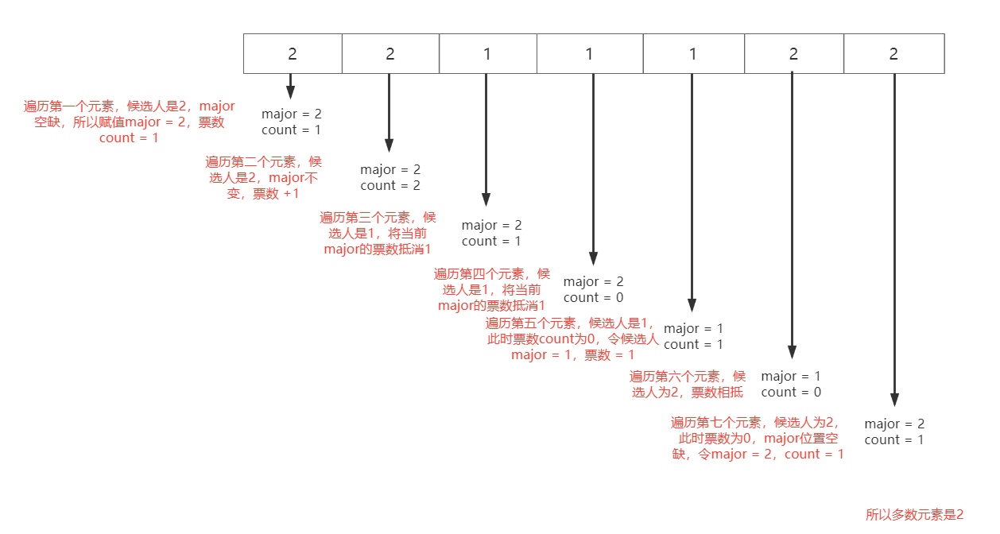
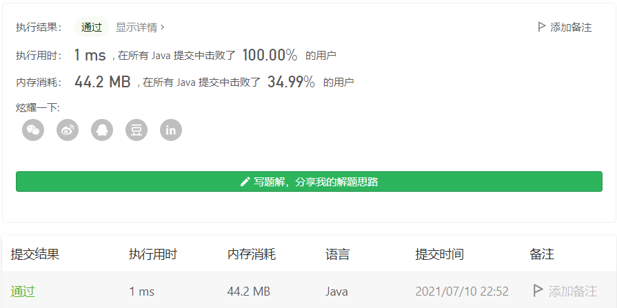

### 1、什么是摩尔投票法

**博耶-摩尔多数投票算法**（英语：Boyer–Moore majority vote algorithm）,中文常作**多数投票算法**、**摩尔投票算法**等，是一种用来寻找一组元素中占多数元素的常数空间级[时间复杂度](https://zh.wikipedia.org/wiki/时间复杂度)算法。

这一算法应用的问题原型是在集合中寻找可能存在的多数元素，这一元素在输入的序列重复出现并占到了序列元素的一半以上；在**第一遍遍历之后应该再进行一个遍历以统计第一次算法遍历的结果出现次数，确定其是否为众数**；如果一个序列中没有占到多数的元素，那么第一次的结果就可能是无效的随机元素。对于数据流而言，则不太可能在亚线性空间复杂度的情况下中就寻找到出现频率最高的元素；而对于序列，其元素的重复次数也有可能很低。

上面的描述来自维基百科。过程可以分为两个阶段：

（1）**投票阶段**：即投票人之间票数进行抵消。

（2）**计数阶段**：计算对抗结果中最后剩下的那个候选人票数是否有效。

### 2、例题

在LeetCode上，有下面几题

（1）[面试题 17.10. 主要元素](https://leetcode-cn.com/problems/find-majority-element-lcci/)

（2）[169. 多数元素](https://leetcode-cn.com/problems/majority-element/)

第（1）道属于不一定存在多数元素的情况，第（2）道属于存在多数元素的情况。对于一定存在多数元素的情况，我们可以不用进行计数阶段。

所以我们直接看第（1）题，因为第一题包含了第（2）题的解法。

> 题目

数组中占比超过一半的元素称之为主要元素。给你一个 整数 数组，找出其中的主要元素。若没有，返回 -1 。请设计时间复杂度为 O(N) 、空间复杂度为 O(1) 的解决方案。

 **示例 1：**

```
输入：[1,2,5,9,5,9,5,5,5]
输出：5
```

**示例 2：**

```
输入：[3,2]
输出：-1
```

**示例 3：**

```
输入：[2,2,1,1,1,2,2]
输出：2
```

> 分析

以示例2为例，[2, 2, 1, 1, 1, 2, 2]



这是存在多数元素的情况，对于不存在多数元素的情况，比如[1, 2, 3]这样的个数为奇数的序列，如果按照上面的方法，最后求的major值为3，这是一个错误的答案。

所以对于不一定存在多数元素的情况下， 我们在求得major后，需要再遍历一次，统计这个major在序列中出现的次数是否大于n / 2，即验证票数是否有效。

> 编码

```java
class Solution {
    public int majorityElement(int[] nums) {
        int major = 0, count = 0;
        for (int i = 0; i < nums.length; i++) {
            if (count == 0) {
                major = nums[i];
            }
            if (major == nums[i]) {
                count++;
            } else {
                count--;
            }
        }

        count = 0;
        for (int num : nums) {
            if (num == major) {
                count++;
            }
        }

        return (count <= nums.length / 2) ? -1 : major;
    }
}
```

