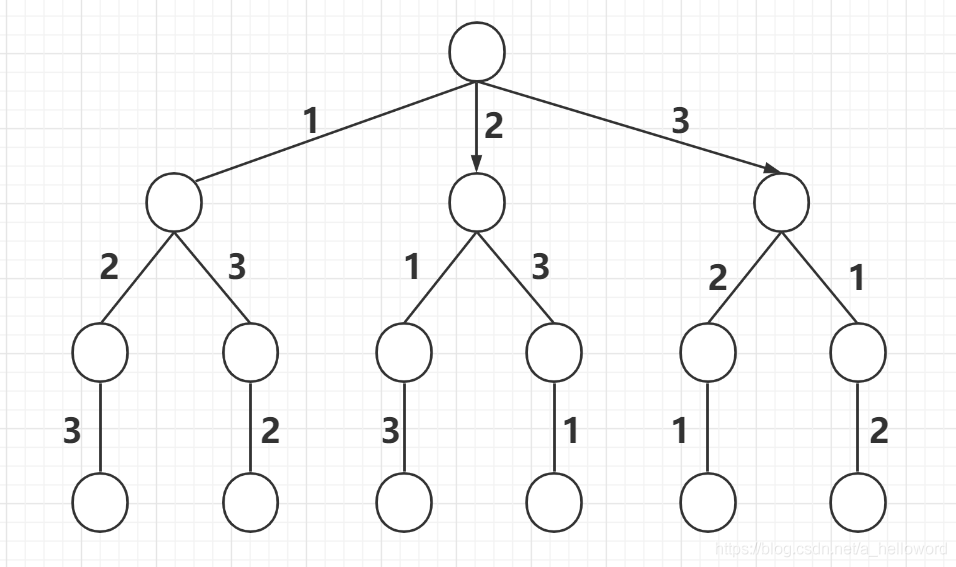
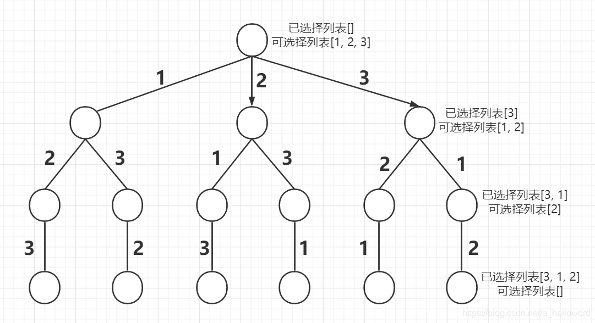
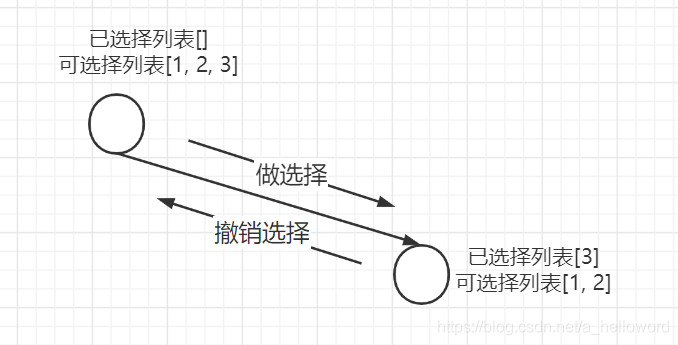
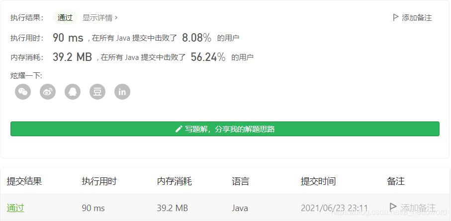

#### 1、了解全排列和回溯

所谓全排列就是从n个元素中取出n个元素按照一定的顺序进行排列，所有的排列情况叫做**全排列**。

这n个元素又分为两种情况，一种是n个元素存在重复元素，一种是n个元素不存在重复元素。不存在重复元素的好办，关键是存在重复元素的，我们在求解过程中需要进行处理。

回溯法，名字很高大上，其实本质就是**穷举**。这里我们结合三道题来理解如何使用回溯法解决全排列问题。

（1）[46. 全排列](https://leetcode-cn.com/problems/permutations/)
（2）[47. 全排列 II](https://leetcode-cn.com/problems/permutations-ii/)
（3）[剑指 Offer 38. 字符串的排列](https://leetcode-cn.com/problems/zi-fu-chuan-de-pai-lie-lcof/)

#### 2、全排列问题分析
比如给定数组[1, 2, 3]，求所有可能的全排列。

如果让我们在纸上写的话，很容易可以写出来[1, 2, 3]，[1, 3, 2]，[2, 1, 3]，[2, 3, 1]，[3, 1, 2]，[3, 2, 1]

不妨抽象成下面这棵树



那么只需要从根节点开始遍历，记录路径上的数字，到叶子节点就得到了一个排序，遍历完这棵树，就得到了全排列。我们可以定义下面几个概念：

- 已选择列表：就是已经选择的元素。
- 可选择列表：就是可以选择的元素。



那么在这里，到叶子节点其实就是可选择列表为空的时候，此时就得到一个排列。就跟二叉树的遍历一样，到了叶子节点后，我们需要回到它的父节点，去走它的同胞节点。所以我们在得到一个全排列之后，再把已选择列表的元素一个个弹出来放到未选择列表，重新进行选择。



那么可以总结出回溯法的伪代码如下

```java
if (已选择列表的长度 == 元素列表长度)
	得到一个全排列
for 元素 in 元素列表
	判断元素是否在可选列表
	# 做选择
	已选列表.add(元素)
	backTrace(元素列表, 已选择列表)
	# 撤销选择
	已选列表.remove(元素)
```
#### 3、实例分析
##### 3.1 不含重复元素的全排列

首先看看不含重复元素的全排列。[46. 全排列](https://leetcode-cn.com/problems/permutations/)

根据上面的思路，其实很快就可以写出来

```java
class Solution {
    List<List<Integer>> res = new LinkedList<>();
    public List<List<Integer>> permute(int[] nums) {
        LinkedList<Integer> track = new LinkedList<>();
        backTrace(nums, track);
        return res;
    }

    private void backTrace(int[] nums, LinkedList<Integer> track) {
        // 相等的时候，说明得到了一个全排列
        if (track.size() == nums.length) {
            res.add(new LinkedList(track));
            return;
        }

        for (int i = 0; i < nums.length; i++) {
            // 如果已经存在该元素，就不添加
            if (track.contains(nums[i])) {
                continue;
            }

            // 选择元素
            track.add(nums[i]);
            backTrace(nums, track);
            // 撤销选择
            track.removeLast();
        }
    }
}
```
是不是和模板大差不差。

##### 3.2 含重复元素的全排列
[47. 全排列 II](https://leetcode-cn.com/problems/permutations-ii/) 和 [剑指 Offer 38. 字符串的排列](https://leetcode-cn.com/problems/zi-fu-chuan-de-pai-lie-lcof/) 。

一道是数字，一道是字符串。

先看数字的。有了上面这题的基础，这道题其实也不难了，在求解的过程中，有两个点需要注意：

- 不能用contains方法去判断list中是否存在重复元素了，这样势必会得不到一个排列。因为我们需要的是不重复的排列而不是不重复的元素，所以我们需要一个boolean数组通过下标去判断某个元素是否已经被加入已选择列表。
- 得到全部排列后，我们需要去掉重复的排序，这里可以把数据结构换成Set进行去重，然后再把Set换成List。不过这种方式是十分低效的，因为有很多无效的状态会被计算。最好的方法就是在回溯过程中进行剪枝，无效的状态直接跳过不计算。

**Set去重**

```java
class Solution {
    Set<List<Integer>> temp = new HashSet<>();
    public List<List<Integer>> permuteUnique(int[] nums) {
        LinkedList<Integer> list = new LinkedList<>();
        // 记录已经访问过的元素
        boolean[] visited = new boolean[nums.length];
        backTrace(nums, list, visited);
        List<List<Integer>> res = new LinkedList<>(temp);
        return res;
    }

    private void backTrace(int[] nums, LinkedList<Integer> list, boolean[] visited) {
        if (list.size() == nums.length) {
            temp.add(new LinkedList(list));
            return;
        }

        for (int i = 0; i < nums.length; i++) {
            if (visited[i]) {
                continue;
            }

            // 下标为i的元素已经访问过
            visited[i] = true;
            list.add(nums[i]);
            backTrace(nums, list, visited);
            // 移除list的元素同时将下标为i的元素置为未访问状态
            list.removeLast();
            visited[i] = false;
        }
    }
}
```
可以发现和上一题不一样的地方，就是使用了一个`boolean[] visited`数组去记录哪些元素被访问哪些没有被访问，而不是通过`contains`方法去判断。另外就是使用了Set去存储排列结果，这样就能去掉重复结果，但效率不太行。



可以发现用Set去重效率十分的低。**需要考虑在回溯过程中进行剪枝，去掉一些无效的中间状态**。可以参考题解：[https://leetcode-cn.com/problems/permutations-ii/solution/hui-su-suan-fa-python-dai-ma-java-dai-ma-by-liwe-2/](https://leetcode-cn.com/problems/permutations-ii/solution/hui-su-suan-fa-python-dai-ma-java-dai-ma-by-liwe-2/)。图文并茂，这里直接上代码

```java
class Solution {
    Set<List<Integer>> temp = new HashSet<>();
    public List<List<Integer>> permuteUnique(int[] nums) {
        LinkedList<Integer> list = new LinkedList<>();
        // 记录已经访问过的元素
        boolean[] visited = new boolean[nums.length];
        // 排序，方便剪枝
        Arrays.sort(nums);
        backTrace(nums, list, visited);
        List<List<Integer>> res = new LinkedList<>(temp);
        return res;
    }

    private void backTrace(int[] nums, LinkedList<Integer> list, boolean[] visited) {
        if (list.size() == nums.length) {
            temp.add(new LinkedList(list));
            return;
        }

        for (int i = 0; i < nums.length; i++) {
            if (visited[i]) {
                continue;
            }

            // 剪枝
            if (i > 0 && nums[i] == nums[i - 1] && !visited[i - 1]) {
                continue;
            }
            
            // 下标为i的元素已经访问过
            visited[i] = true;
            list.add(nums[i]);
            backTrace(nums, list, visited);
            // 移除list的元素同时将下标为i的元素置为未访问状态
            list.removeLast();
            visited[i] = false;
        }
    }
}
```


可以发现时间从90ms -> 4ms，但这个击败率。。。

-----

接下来看看重复字符串的， [剑指 Offer 38. 字符串的排列](https://leetcode-cn.com/problems/zi-fu-chuan-de-pai-lie-lcof/) 

其实这道和重复数字的大差不差，只是数据类型不一样罢了。。不信看代码

```java
class Solution {
    public String[] permutation(String s) {
        // Set去重
        Set<String> set = new HashSet<>();
        char[] chs = s.toCharArray();
        // 记录已经访问过的字符
        boolean[] visited = new boolean[s.length()];
        char[] temp = new char[s.length()];
        backTrace(0, chs, set, visited, temp);
        StringBuilder sb = new StringBuilder();
        set.stream().forEach(str -> {
            sb.append(str + ",");
        });
        return sb.substring(0, sb.length() - 1).toString().split(",");
    }

    private void backTrace(int index, char[] chs, Set<String> set, boolean[] visited, char[] con) {
        if (index == chs.length) {
            set.add(new String(con));
            return;
        }

        for (int i = 0; i < chs.length; i++) {
            if (!visited[i]) {
                visited[i] = true;
                con[index] = chs[i];
                backTrace(index + 1, chs, set, visited, con);
                visited[i] = false;
            }
        }
    }
}
```
#### 4、总结
全排列问题，其实只要记住了这个思路和套路，基本上要写出来都没问题，万变不离其宗，多刷几道题就可以了。