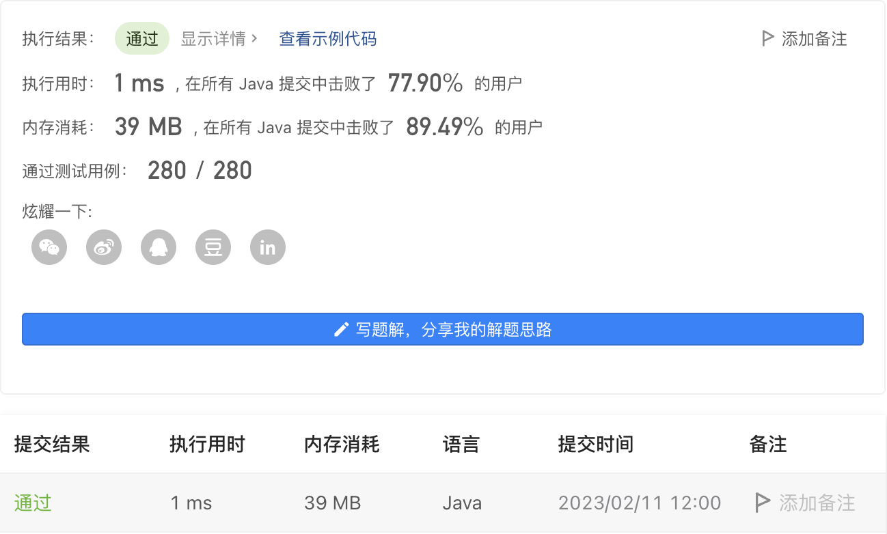

#### 2335. 装满杯子需要的最短总时长

#### 2023-02-11 LeetCode每日一题

链接：https://leetcode.cn/problems/minimum-amount-of-time-to-fill-cups/

标签：**数组、排序、贪心**

> 题目

现有一台饮水机，可以制备冷水、温水和热水。每秒钟，可以装满 2 杯 不同 类型的水或者 1 杯任意类型的水。

给你一个下标从 0 开始、长度为 3 的整数数组 amount ，其中 amount[0]、amount[1] 和 amount[2] 分别表示需要装满冷水、温水和热水的杯子数量。返回装满所有杯子所需的 最少 秒数。

示例 1：

```java
输入：amount = [1,4,2]
输出：4
解释：下面给出一种方案：
第 1 秒：装满一杯冷水和一杯温水。
第 2 秒：装满一杯温水和一杯热水。
第 3 秒：装满一杯温水和一杯热水。
第 4 秒：装满一杯温水。
可以证明最少需要 4 秒才能装满所有杯子。
```

示例 2：

```java
输入：amount = [5,4,4]
输出：7
解释：下面给出一种方案：
第 1 秒：装满一杯冷水和一杯热水。
第 2 秒：装满一杯冷水和一杯温水。
第 3 秒：装满一杯冷水和一杯温水。
第 4 秒：装满一杯温水和一杯热水。
第 5 秒：装满一杯冷水和一杯热水。
第 6 秒：装满一杯冷水和一杯温水。
第 7 秒：装满一杯热水。
```

示例 3：

```java
输入：amount = [5,0,0]
输出：5
解释：每秒装满一杯冷水。
```


提示：

- amount.length == 3
- 0 <= amount[i] <= 100

> 分析

每次尽量装两杯水。可以先把数组进行排序，当amount[0] + amount[1] <= amount[2]的时候，每次装amount[2]的时候都可以同时装amount[0]或者amount[1]，所以最多只需要amount[2]秒。

如果amount[0] + amount[1] > amount[2]，每次尽可能装2杯水，这样只需要总和一半的次数就可以了。

> 编码

```java
class Solution {
    public int fillCups(int[] amount) {
        Arrays.sort(amount);
        if (amount[0] + amount[1] <= amount[2]) {
            return amount[2];
        }
        return (amount[0] + amount[1] + amount[2] + 1) / 2;
    }
}
```

