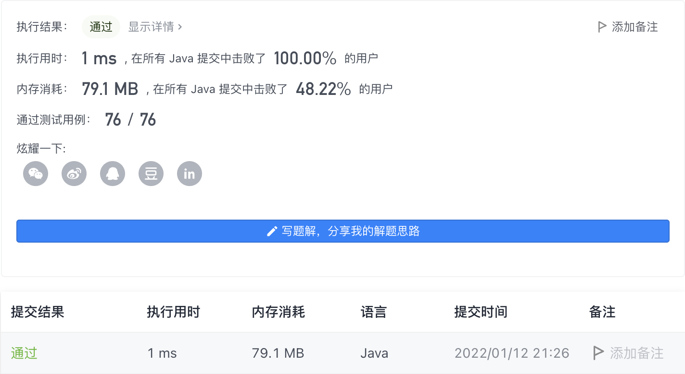

#### 334. 递增的三元子序列

#### 2022-01-12 LeetCode每日一题

链接：https://leetcode-cn.com/problems/increasing-triplet-subsequence/

标签：**数组、贪心**

> 题目

给你一个整数数组 nums ，判断这个数组中是否存在长度为 3 的递增子序列。

如果存在这样的三元组下标 (i, j, k) 且满足 i < j < k ，使得 nums[i] < nums[j] < nums[k] ，返回 true ；否则，返回 false 。

示例 1：

```java
输入：nums = [1,2,3,4,5]
输出：true
解释：任何 i < j < k 的三元组都满足题意
```

示例 2：

```java
输入：nums = [5,4,3,2,1]
输出：false
解释：不存在满足题意的三元组
```

示例 3：

```java
输入：nums = [2,1,5,0,4,6]
输出：true
解释：三元组 (3, 4, 5) 满足题意，因为 nums[3] == 0 < nums[4] == 4 < nums[5] == 6
```


提示：

- 1 <= nums.length <= 5 * 10 ^ 5
- -2 ^ 31 <= nums[i] <= 2 ^ 31 - 1


进阶：你能实现时间复杂度为 O(n) ，空间复杂度为 O(1) 的解决方案吗？

> 分析

参考[此链接](https://leetcode-cn.com/problems/increasing-triplet-subsequence/solution/c-xian-xing-shi-jian-fu-za-du-xiang-xi-jie-xi-da-b/)

> 编码

```java
class Solution {
    public boolean increasingTriplet(int[] nums) {
        if (nums.length < 3) {
            return false;
        }

        // small和mid表示长度为3的递增子序列中的最小值和中间值
        int small = Integer.MAX_VALUE, mid = Integer.MAX_VALUE;
        for (int i = 0; i < nums.length; i++) {
            if (nums[i] <= small) {
                small = nums[i];
            } else if (nums[i] <= mid) {
                mid = nums[i];
            } else {
                return true;
            }
        }

        return false;
    }
}
```

