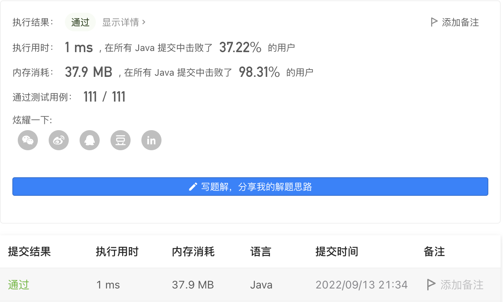

#### 670. 最大交换

#### 2022-09-13 LeetCode每日一题

链接：https://leetcode.cn/problems/maximum-swap/

标签：**贪心、数学**

> 题目

给定一个非负整数，你至多可以交换一次数字中的任意两位。返回你能得到的最大值。

示例 1 :

```java
输入: 2736
输出: 7236
解释: 交换数字2和数字7。
```

示例 2 :

```java
输入: 9973
输出: 9973
解释: 不需要交换。
```

注意:

- 给定数字的范围是 [0, 10 ^ 8]

> 分析

可以先把字符串拆分成一个个数字放入数组nums，然后深拷贝一个数组copy，对copy降序排序。然后对两个数组从左往右开始比较，当遇到第一个不相等的数时，假设下标为i，说明需要把nums数组中[i + 1, nums.length - 1]范围里值为copy[i]的数和nums[i]交换位置。但在这个范围内可能出现多个值为copy[i]的数，所以我们需要从后往前遍历，把最低位的copy[i]放到前面，这样才能得到最大值。

> 编码

```java
class Solution {
    public int maximumSwap(int num) {
        String str = String.valueOf(num);
        Integer[] nums = new Integer[str.length()];
        for (int i = 0; i < str.length(); i++) {
            nums[i] = str.charAt(i) - '0';
        }
        Integer[] copy = Arrays.copyOfRange(nums, 0, nums.length);
        Arrays.sort(copy, (a, b) -> b - a);
        boolean flag = true;

        for (int i = 0; i < nums.length && flag; i++) {
            if (copy[i] != nums[i]) {
                // 从右往左遍历，保证把最小位的copy[i]放到前面
                for (int j = nums.length - 1; j >= 0; --j) {
                    if (nums[j] == copy[i]) {
                        int temp = nums[i];
                        nums[i] = copy[i];
                        nums[j] = temp;
                        flag = false;
                        break;
                    }
                }
            }
        }

        int res = 0;
        for (int i = 0; i < nums.length; i++) {
            res = res * 10 + nums[i];
        }

        return res;
    }
}
```




