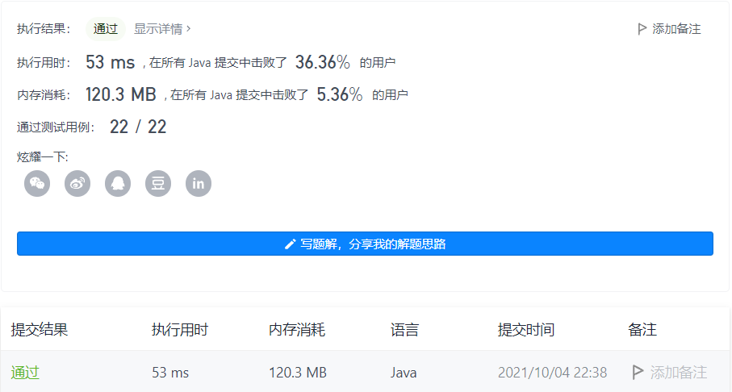

#### 146. LRU 缓存机制

链接：https://leetcode-cn.com/problems/lru-cache/

标签：**设计、哈希表、双向链表、链表**

> 题目

运用你所掌握的数据结构，设计和实现一个  LRU (最近最少使用) 缓存机制 。
实现 LRUCache 类：

- LRUCache(int capacity) 以正整数作为容量 capacity 初始化 LRU 缓存
- int get(int key) 如果关键字 key 存在于缓存中，则返回关键字的值，否则返回 -1 。
- void put(int key, int value) 如果关键字已经存在，则变更其数据值；如果关键字不存在，则插入该组「关键字-值」。当缓存容量达到上限时，它应该在写入新数据之前删除最久未使用的数据值，从而为新的数据值留出空间。


进阶：你是否可以在 O(1) 时间复杂度内完成这两种操作？

示例：

```java
输入
["LRUCache", "put", "put", "get", "put", "get", "put", "get", "get", "get"]
[[2], [1, 1], [2, 2], [1], [3, 3], [2], [4, 4], [1], [3], [4]]
输出
[null, null, null, 1, null, -1, null, -1, 3, 4]

解释
LRUCache lRUCache = new LRUCache(2);
lRUCache.put(1, 1); // 缓存是 {1=1}
lRUCache.put(2, 2); // 缓存是 {1=1, 2=2}
lRUCache.get(1);    // 返回 1
lRUCache.put(3, 3); // 该操作会使得关键字 2 作废，缓存是 {1=1, 3=3}
lRUCache.get(2);    // 返回 -1 (未找到)
lRUCache.put(4, 4); // 该操作会使得关键字 1 作废，缓存是 {4=4, 3=3}
lRUCache.get(1);    // 返回 -1 (未找到)
lRUCache.get(3);    // 返回 3
lRUCache.get(4);    // 返回 4
```


提示：

- 1 <= capacity <= 3000
- 0 <= key <= 10000
- 0 <= value <= 10 ^ 5
- 最多调用 2 * 10 ^ 5 次 get 和 put

> 分析

LRU (最近最少使用) ，一种数据淘汰策略算法，在页面置换、Redis数据淘汰中都存在这种算法。实现的思路也比较简单，使用**双向链表 + 哈希表**。

哈希表在这里的作用主要是为了实现O(1)复杂度获取到对应的node。我们只需要在访问节点后，把该节点移到链表的头部，保证双向链表的尾部是最久未访问的数据即可。当缓存的容量达到上限时，只需要把双向链表尾部的节点移除即可。

> 编码

```java
class LRUCache {
    // 双向链表 + HashMap
    private Node head;
    private Node tail;
    // key->node，实现O(1)复杂度获取node
    private HashMap<Integer, Node> map;
    private int maxSize;

    private class Node {
        Node pre;
        Node next;
        Integer key;
        Integer value;
        public Node(Integer key, Integer value) {
            this.key = key;
            this.value = value;
        }
    }

    public LRUCache(int capacity) {
        this.maxSize = capacity;
        head = new Node(null, null);
        tail = new Node(null, null);
        head.next = tail;
        tail.pre = head;
        map = new HashMap<>(capacity);
    }
    
    public int get(int key) {
        // 没有命中，返回-1
        if (!map.containsKey(key)) {
            return -1;
        }
        // 命中后，需要把对应的node移到链表的头部，保证链表的尾部是最久未访问的
        Node node = map.get(key);
        unlink(node);
        appendHead(node);
        return node.value;
    }
    
    public void put(int key, int value) {
        // 如果缓存已经存在，则删除原来的
        if (map.containsKey(key)) {
            Node node = map.get(key);
            unlink(node);
        } else {
            // 如果容量达到上限，需要先移除链表尾的节点，再插入新的节点
            if (map.size() >= maxSize) {
                Node removeNode = removeTail();
                map.remove(removeNode.key);
            }
        }

        // 插入节点到链表头部
        Node node = new Node(key, value);
        map.put(key, node);
        appendHead(node);
    }

    /**
     * 释放node节点
     */
    private void unlink(Node node) {
        Node pre = node.pre;
        Node next = node.next;
        pre.next = next;
        next.pre = pre;
        node.pre = null;
        node.next = null;
    }

    /**
     * 将node节点插入链表头部
     */
    private void appendHead(Node node) {
        Node next = head.next;
        node.next = next;
        next.pre = node;
        node.pre = head;
        head.next = node;
    }

    /**
     * 删除链表尾节点
     */
    private Node removeTail() {
        Node node = tail.pre;
        Node pre = node.pre;
        pre.next = tail;
        tail.pre = pre;

        node.next = null;
        node.pre = null;
        return node;
    }
}

/**
 * Your LRUCache object will be instantiated and called as such:
 * LRUCache obj = new LRUCache(capacity);
 * int param_1 = obj.get(key);
 * obj.put(key,value);
 */
```



这个击败率感觉还不如调api来滴实在啊。