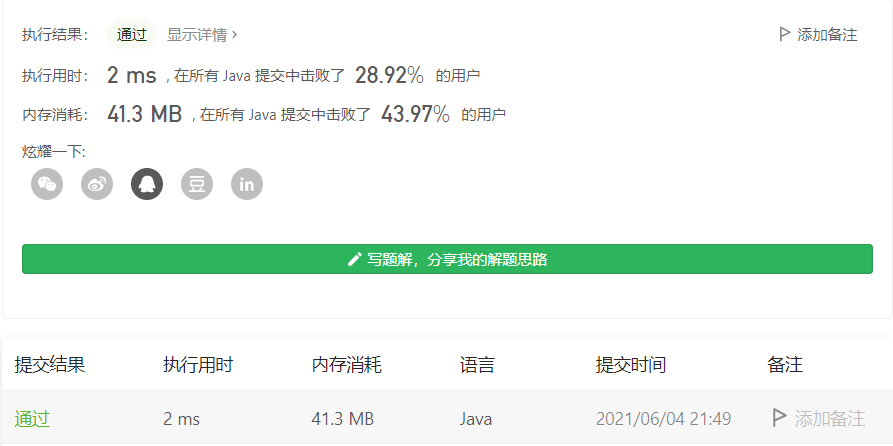
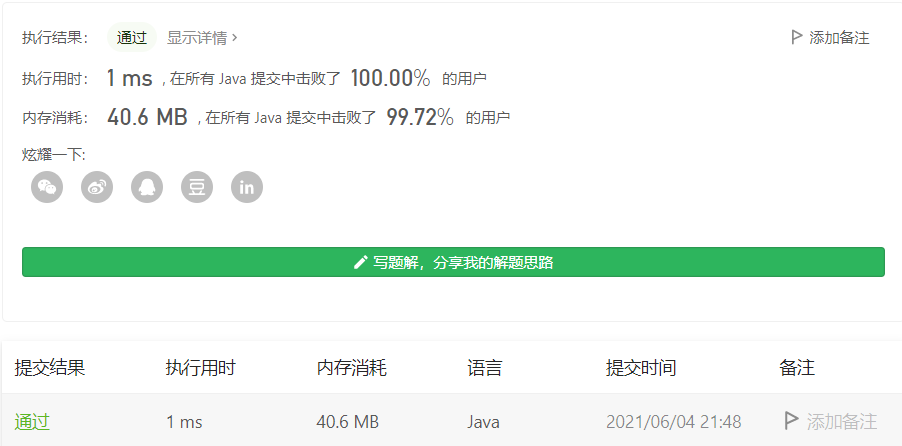
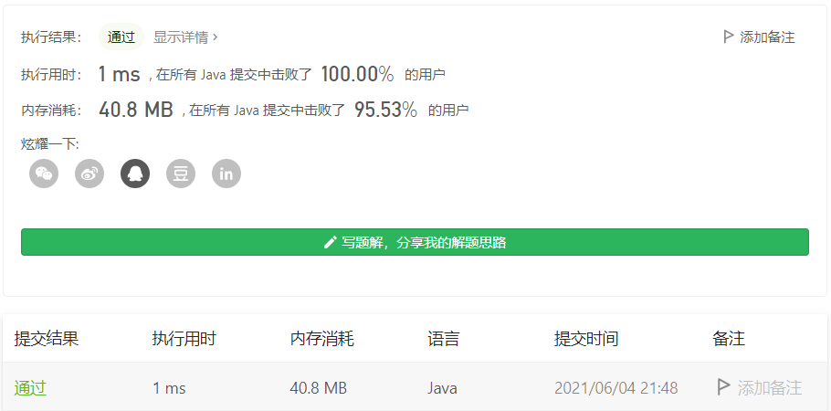

#### 160. 相交链表

#### 2021-06-04 LeetCode每日一题

链接：https://leetcode-cn.com/problems/intersection-of-two-linked-lists/

标签：**链表**

> 题目

给你两个单链表的头节点 headA 和 headB ，请你找出并返回两个单链表相交的起始节点。如果两个链表没有交点，返回 null 。

图示两个链表在节点 c1 开始相交：


题目数据 **保证** 整个链式结构中不存在环。

**注意**，函数返回结果后，链表必须 **保持其原始结构** 。


```java
输入：intersectVal = 8, listA = [4,1,8,4,5], listB = [5,0,1,8,4,5], skipA = 2, skipB = 3
输出：Intersected at '8'
解释：相交节点的值为 8 （注意，如果两个链表相交则不能为 0）。
从各自的表头开始算起，链表 A 为 [4,1,8,4,5]，链表 B 为 [5,0,1,8,4,5]。
在 A 中，相交节点前有 2 个节点；在 B 中，相交节点前有 3 个节点。
```


```java
输入：intersectVal = 2, listA = [0,9,1,2,4], listB = [3,2,4], skipA = 3, skipB = 1
输出：Intersected at '2'
解释：相交节点的值为 2 （注意，如果两个链表相交则不能为 0）。
从各自的表头开始算起，链表 A 为 [0,9,1,2,4]，链表 B 为 [3,2,4]。
在 A 中，相交节点前有 3 个节点；在 B 中，相交节点前有 1 个节点。
```


```java
输入：intersectVal = 0, listA = [2,6,4], listB = [1,5], skipA = 3, skipB = 2
输出：null
解释：从各自的表头开始算起，链表 A 为 [2,6,4]，链表 B 为 [1,5]。
由于这两个链表不相交，所以 intersectVal 必须为 0，而 skipA 和 skipB 可以是任意值。
这两个链表不相交，因此返回 null 。
```

```java
listA 中节点数目为 m
listB 中节点数目为 n
0 <= m, n <= 3 * 104
1 <= Node.val <= 105
0 <= skipA <= m
0 <= skipB <= n
如果 listA 和 listB 没有交点，intersectVal 为 0
如果 listA 和 listB 有交点，intersectVal == listA[skipA + 1] == listB[skipB + 1]
```

**进阶：**你能否设计一个时间复杂度 `O(n)` 、仅用 `O(1)` 内存的解决方案？

> 解析

题目要求设计一个时间复杂度O(n)，空间复杂度O(1)的答案。一般我们的思路都是需要两层循环，但仔细看看两个链表，发现其实有这么一个方法：两个链表A和B一起走，当链表A走到末尾的时候，让它重新指向链表B的头，然后A、B继续走，当B走到末尾的时候，让它重新指向A的头，这时候两个链表其实是距离链表尾是一样的距离。这时候只需要两个链表一起走，判断有没有相等的节点即可，有就返回，没有两个会同时走到末尾，指向null。

我能想到这个思路是因为之前我记得在哪看到过这个题目，脑子里还有一点印象，不然我感觉这个方法不太好想==。想出了这个方法用了10分钟，怎么把它写的优雅一点想了我20分钟。

> 编码

不优雅写法：用了一个count计数，防止没有交点的时候死循环

```java
/**
 * Definition for singly-linked list.
 * public class ListNode {
 *     int val;
 *     ListNode next;
 *     ListNode(int x) {
 *         val = x;
 *         next = null;
 *     }
 * }
 */
public class Solution {
    public ListNode getIntersectionNode(ListNode headA, ListNode headB) {
        ListNode root1 = headA, root2 = headB;
        int count = 0;
        while (root1 != null && root2 != null && root1 != root2) {
            root1 = root1.next;
            root2 = root2.next;
            if (root1 == null && count < 2) {
                root1 = headB;
                count++;
            }

            if (root2 == null && count < 2) {
                root2 = headA;
                count++;
            }
        }   

        return root1;
    }
}
```



优雅写法：

```java
/**
 * Definition for singly-linked list.
 * public class ListNode {
 *     int val;
 *     ListNode next;
 *     ListNode(int x) {
 *         val = x;
 *         next = null;
 *     }
 * }
 */
public class Solution {
    public ListNode getIntersectionNode(ListNode headA, ListNode headB) {
        ListNode root1 = headA, root2 = headB;
        while (root1 != root2) {
            if (root1 == null) {
                root1 = headB;
            } else {
                root1 = root1.next; 
            }

            if (root2 == null) {
                root2 = headA;
            } else {
                root2 = root2.next;
            }
        }   

        return root1;
    }
}
```



还可以更优雅一点：

```java
/**
 * Definition for singly-linked list.
 * public class ListNode {
 *     int val;
 *     ListNode next;
 *     ListNode(int x) {
 *         val = x;
 *         next = null;
 *     }
 * }
 */
public class Solution {
    public ListNode getIntersectionNode(ListNode headA, ListNode headB) {
        ListNode root1 = headA, root2 = headB;
        while (root1 != root2) {
            root1 = root1 == null ? headB : root1.next;
            root2 = root2 == null ? headA : root2.next;
        }   

        return root1;
    }
}
```



不同写法，时间相差也很大，所以要知道怎么写，也要学会怎么写更优雅，看起来也更舒服。