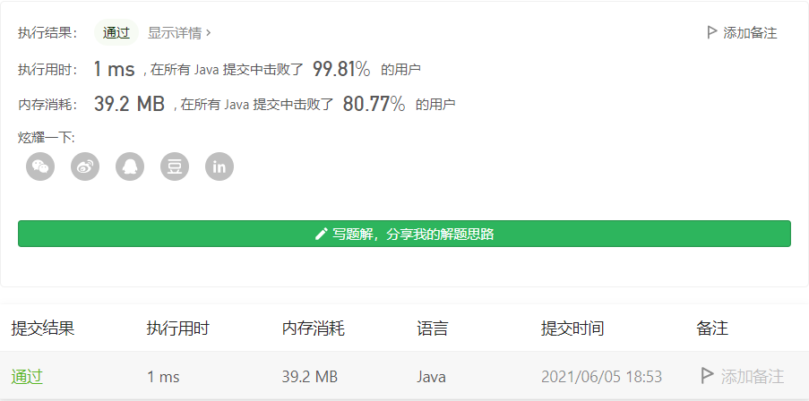
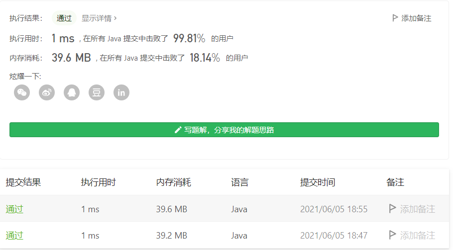

#### 203. 移除链表元素

#### 2021-06-05 LeetCode每日一题

链接：https://leetcode-cn.com/problems/remove-linked-list-elements/

标签：**链表**

> 题目

给你一个链表的头节点 `head` 和一个整数 `val` ，请你删除链表中所有满足 `Node.val == val` 的节点，并返回 **新的头节点** 。


```java
输入：head = [1,2,6,3,4,5,6], val = 6
输出：[1,2,3,4,5]
    
输入：head = [], val = 1
输出：[]
    
输入：head = [7,7,7,7], val = 7
输出：[]
    
列表中的节点在范围 [0, 104] 内
1 <= Node.val <= 50
0 <= k <= 50
```

> 分析

这题难点在于怎么处理头结点，因为是单向链表，无法通过当前节点找到它的前一节点，所以每次循环都是判断下一节点是否和val相同，相同就移除，那头结点的判断移除就是本题的关键。

在这里，我们可以在头结点之前增加一个节点作为辅助，这样就很简单了。也可以不增加辅助节点。

> 编码

不增加辅助节点：

```java
/**
 * Definition for singly-linked list.
 * public class ListNode {
 *     int val;
 *     ListNode next;
 *     ListNode() {}
 *     ListNode(int val) { this.val = val; }
 *     ListNode(int val, ListNode next) { this.val = val; this.next = next; }
 * }
 */
class Solution {
    public ListNode removeElements(ListNode head, int val) {
        if (head == null) {
            return null;
        }

        ListNode root = head;
        while (root != null && root.next != null) {
            if (root.next.val == val) {
                root.next = root.next.next;
            } else {
                root = root.next;
            }
        }

        // 处理头结点
        if (head.val == val) {
            head = head.next;
        }

        return head;
    }
}
```



增加辅助节点：

```java
/**
 * Definition for singly-linked list.
 * public class ListNode {
 *     int val;
 *     ListNode next;
 *     ListNode() {}
 *     ListNode(int val) { this.val = val; }
 *     ListNode(int val, ListNode next) { this.val = val; this.next = next; }
 * }
 */
class Solution {
    public ListNode removeElements(ListNode head, int val) {
        ListNode node = new ListNode(-1);
        node.next = head;
        ListNode root = node;
        while (root != null && root.next != null) {
            if (root.next.val == val) {
                root.next = root.next.next;
            } else {
                root = root.next;
            }
        }

        return node.next;
    }
}
```

