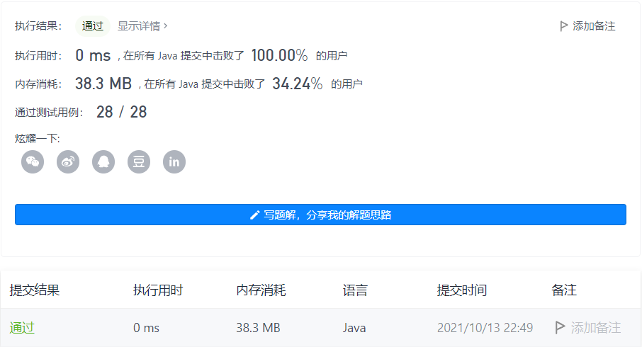

#### 206. 反转链表

链接：https://leetcode-cn.com/problems/reverse-linked-list/

标签：**递归、链表**

> 题目

给你单链表的头节点 `head` ，请你反转链表，并返回反转后的链表。

**示例 1：**


```
输入：head = [1,2,3,4,5]
输出：[5,4,3,2,1]
```

**示例 2：**


```java
输入：head = [1,2]
输出：[2,1]
```

示例 3：

```java
输入：head = []
输出：[]
```


提示：

- 链表中节点的数目范围是 [0, 5000]
- -5000 <= Node.val <= 5000

> 分析

可以使用两个节点，不断后移，后一节点的next指向前面那个元素即可。

> 编码

```java
/**
 * Definition for singly-linked list.
 * public class ListNode {
 *     int val;
 *     ListNode next;
 *     ListNode() {}
 *     ListNode(int val) { this.val = val; }
 *     ListNode(int val, ListNode next) { this.val = val; this.next = next; }
 * }
 */
class Solution {
    public ListNode reverseList(ListNode head) {
        ListNode prev = null, cur = head;
        while (cur != null) {
            ListNode next = cur.next;
            cur.next = prev;
            prev = cur;
            cur = next;
        }

        return prev;
    }
}
```

