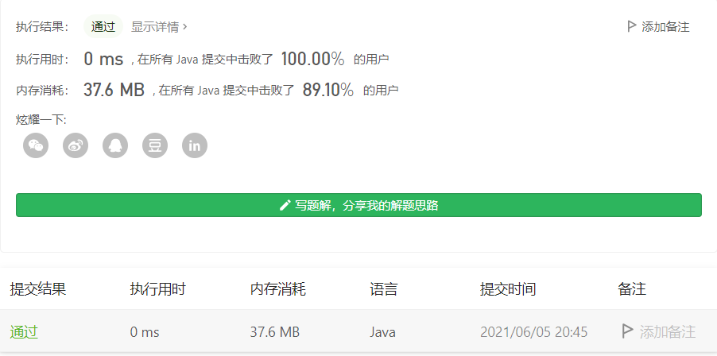

#### 237. 删除链表中的节点

链接：https://leetcode-cn.com/problems/delete-node-in-a-linked-list/

标签：**链表**

> 题目

请编写一个函数，使其可以删除某个链表中给定的（非末尾）节点。传入函数的唯一参数为 要被删除的节点 。

现有一个链表 -- head = [4,5,1,9]，它可以表示为:


```java
输入：head = [4,5,1,9], node = 5
输出：[4,1,9]
解释：给定你链表中值为 5 的第二个节点，那么在调用了你的函数之后，该链表应变为 4 -> 1 -> 9.

输入：head = [4,5,1,9], node = 1
输出：[4,5,9]
解释：给定你链表中值为 1 的第三个节点，那么在调用了你的函数之后，该链表应变为 4 -> 5 -> 9.

链表至少包含两个节点。
链表中所有节点的值都是唯一的。
给定的节点为非末尾节点并且一定是链表中的一个有效节点。
不要从你的函数中返回任何结果。
```

> 分析

这题看了老半天不知道啥意思，就给了个node节点，也没给你头结点head，这要怎么删？

此题说链表中所有节点的值唯一，意味着只需要把node节点去掉就行了，但这里我们只有node节点，你如果想要把node节点移除估计不太可能，因为是单向链表，我们不知道node节点的上一个节点。

这里我们能做的就是把node节点的下一个节点干掉，相当于找个替死鬼。

> 编码

```java
/**
 * Definition for singly-linked list.
 * public class ListNode {
 *     int val;
 *     ListNode next;
 *     ListNode(int x) { val = x; }
 * }
 */
class Solution {
    public void deleteNode(ListNode node) {
        // node节点的下一个节点值赋给node
        node.val = node.next.val;
        // 把node的下一个节点干掉，node此时就成为了node.next
        node.next = node.next.next;
    }
}
```

