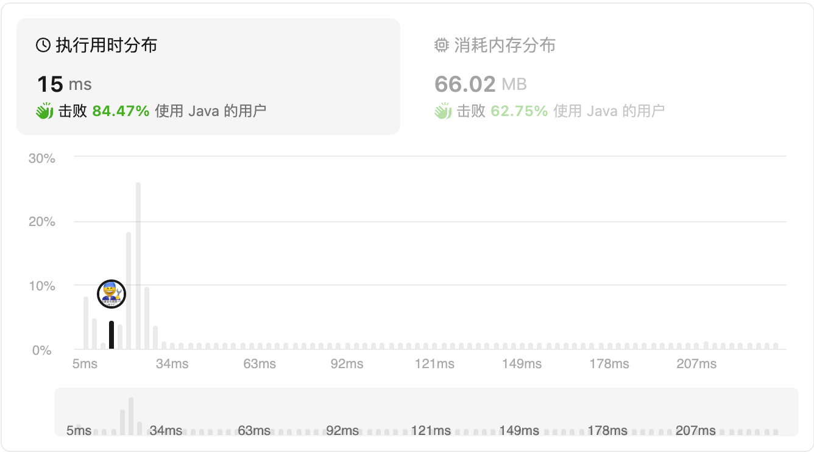
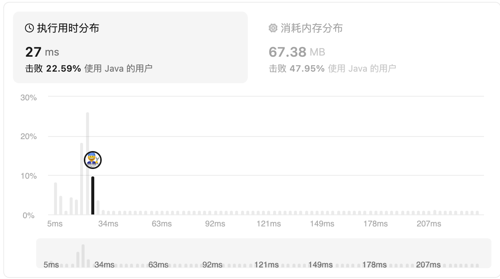

#### 2487.从链表中移除节点

链接：https://leetcode.cn/problems/remove-nodes-from-linked-list/

标签：**链表、单调栈、递归**

难度：中等

> 题目

给你一个链表的头节点 `head` 。

移除每个右侧有一个更大数值的节点。

返回修改后链表的头节点 `head` 。 

**示例 1：**


```
输入：head = [5,2,13,3,8]
输出：[13,8]
解释：需要移除的节点是 5 ，2 和 3 。
- 节点 13 在节点 5 右侧。
- 节点 13 在节点 2 右侧。
- 节点 8 在节点 3 右侧。
```

**示例 2：**

```
输入：head = [1,1,1,1]
输出：[1,1,1,1]
解释：每个节点的值都是 1 ，所以没有需要移除的节点。
```

**提示：**

- 给定列表中的节点数目在范围 `[1, 10^5]` 内
- `1 <= Node.val <= 10^5`

> 分析

解法1：可以遍历链表把所有元素记录下来放到数组，然后从右往左遍历数组，记录每个子区间的最大值，最后遍历链表，通过把当前链表元素值与右边子区间的最大值做比较，判断是否要移除当前链表元素。

解法2：使用双向队列存放链表元素，循环遍历链表，当链表当前元素大于栈顶元素时，移除栈顶元素，直到栈顶元素不小于链表当前元素或者栈为空，此时把链表当前元素加入栈顶。最后栈中存在的元素即为需要保留的元素，从栈底开始遍历组成新链表返回即可。

> 编码

```java
/**
 * Definition for singly-linked list.
 * public class ListNode {
 *     int val;
 *     ListNode next;
 *     ListNode() {}
 *     ListNode(int val) { this.val = val; }
 *     ListNode(int val, ListNode next) { this.val = val; this.next = next; }
 * }
 */
class Solution {
    public ListNode removeNodes(ListNode head) {
        List<Integer> list = new ArrayList<>();
        ListNode node1 = head;
        while (node1 != null) {
            list.add(node1.val);
            node1 = node1.next;
        }
        // nums[i]表示下标i到n - 1的子序列最大值
        int[] nums = new int[list.size() + 1];
        for (int i = list.size() - 1; i >= 0; --i) {
            if (list.get(i) > nums[i + 1]) {
                nums[i] = list.get(i);
            } else {
                nums[i] = nums[i + 1];
            }
        }

        ListNode node2 = head;
        int count = 1;
        ListNode root = new ListNode(0);
        ListNode res = root;
        while (node2 != null) {
            if (node2.val >= nums[count++]) {
                root.next = new ListNode(node2.val);
                root = root.next;
            }
            node2 = node2.next;
        }

        return res.next;
    }
}
```



```java
/**
 * Definition for singly-linked list.
 * public class ListNode {
 *     int val;
 *     ListNode next;
 *     ListNode() {}
 *     ListNode(int val) { this.val = val; }
 *     ListNode(int val, ListNode next) { this.val = val; this.next = next; }
 * }
 */
class Solution {
    public ListNode removeNodes(ListNode head) {
        // 双向队列
        Deque<Integer> deque = new LinkedList<>();
        while (head != null) {
            int num = head.val;
            // 当前元素大于栈顶元素，移除栈顶元素
            while (!deque.isEmpty() && num > deque.peekFirst()) {
                deque.pollFirst();
            }
            deque.addFirst(head.val);
            head = head.next;
        }

        ListNode root = new ListNode(0);
        ListNode res = root;
        while (!deque.isEmpty()) {
            // 从栈底开始取元素
            root.next = new ListNode(deque.pollLast());
            root = root.next;
        }
        return res.next;
    }
}
```

