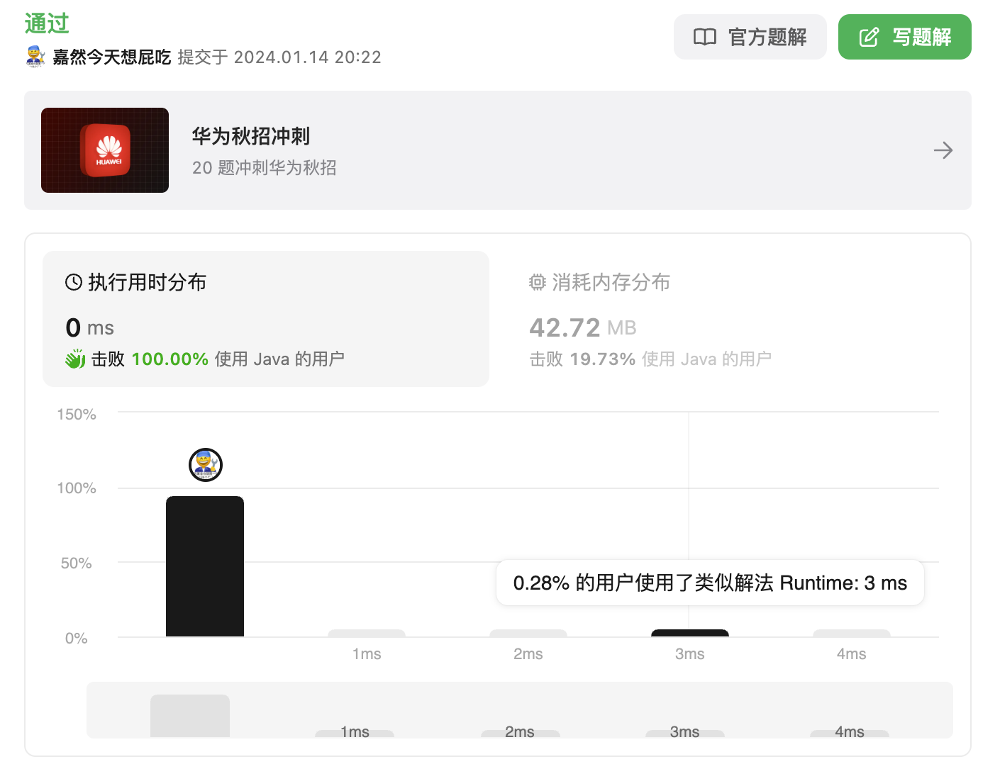

83. 删除排序链表中的重复元素

#### 2024-01-14 LeetCode每日一题

链接：https://leetcode.cn/problems/remove-duplicates-from-sorted-list/

标签：链表

> 题目

给定一个已排序的链表的头 `head` ， *删除所有重复的元素，使每个元素只出现一次* 。返回 *已排序的链表* 。

**示例 1：**

```
输入：head = [1,1,2]
输出：[1,2]
```

**示例 2：**

```
输入：head = [1,1,2,3,3]
输出：[1,2,3]
```

**提示：**

- 链表中节点数目在范围 `[0, 300]` 内
- `-100 <= Node.val <= 100`
- 题目数据保证链表已经按升序 **排列**

> 编码

```java
/**
 * Definition for singly-linked list.
 * public class ListNode {
 *     int val;
 *     ListNode next;
 *     ListNode() {}
 *     ListNode(int val) { this.val = val; }
 *     ListNode(int val, ListNode next) { this.val = val; this.next = next; }
 * }
 */
class Solution {
    public ListNode deleteDuplicates(ListNode head) {
        ListNode node = head;
        while (node != null && node.next != null) {
            if (node.val == node.next.val) {
                node.next = node.next.next;
            } else {
                node = node.next;
            }
        }

        return head;
    }
}
```

