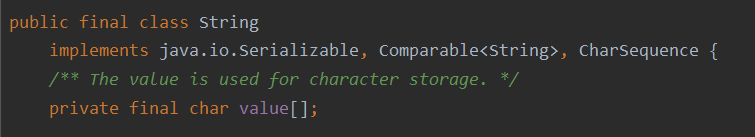
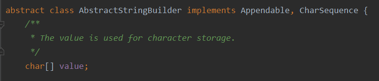

#### 1、String、StringBuffer和StringBuilder的区别是什么？String为啥是不可变的？

`String`类内部使用`final char value[]`存储值，所以是不可变的。

而StringBuilder和StringBuffer都继承自`AbstractStringBuilder`类，该类内部使用`char[] value`存储值，所以是可变的。

