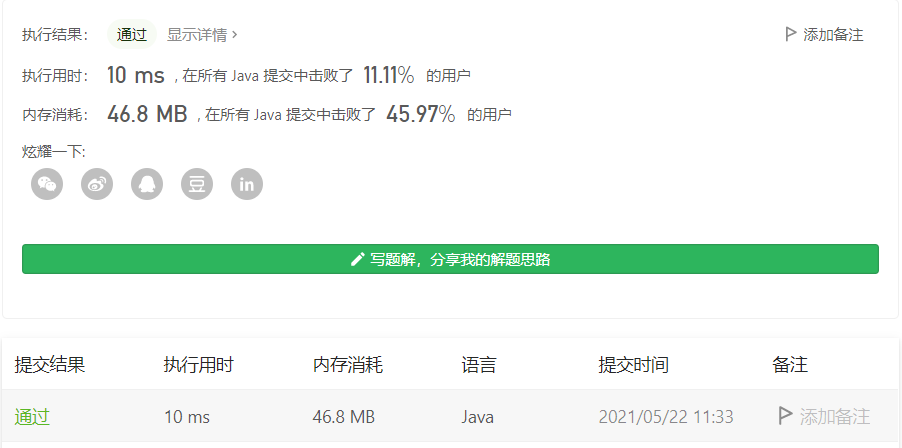
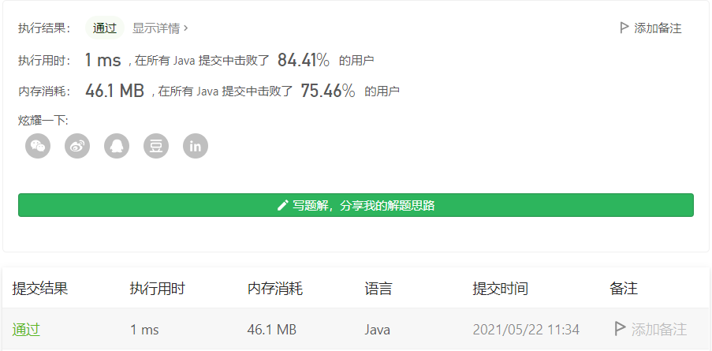
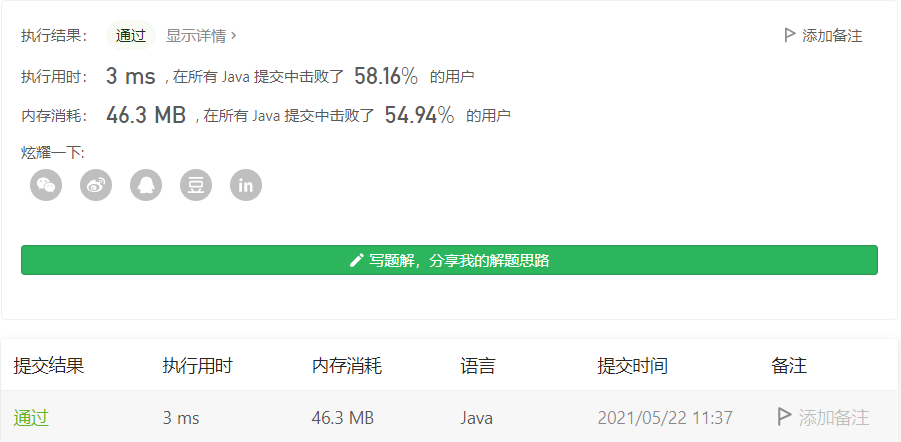

#### 剑指 Offer 03. 数组中重复的数字

链接：https://leetcode-cn.com/problems/shu-zu-zhong-zhong-fu-de-shu-zi-lcof/

标签：**数组、哈希表**

> 题目

找出数组中重复的数字。


在一个长度为 n 的数组 nums 里的所有数字都在 0～n-1 的范围内。数组中某些数字是重复的，但不知道有几个数字重复了，也不知道每个数字重复了几次。请找出数组中任意一个重复的数字。

```java
输入：
[2, 3, 1, 0, 2, 5, 3]
输出：2 或 3 
    
2 <= n <= 100000
```

> 分析

解法1：既然题目说标签是哈希表，那么直接用hash表去做肯定是可以的。只需要循环然后把元素作为键存入哈希表，每次在存之前判断一下该元素在哈希表中是否存在，如果存在就说明该元素重复，直接返回即可。

解法2：注意题目有一个不容易发现的条件，那就是**所有数字都在 0～n-1 的范围内**，这就提供了另一种解法，那就是定义一个数组，数组的index是nums[i]，这样对于相同的数，index是一样的，就能判断出是否有重复数字。如果这里没有[所有数字都在 0～n-1 的范围内]这个条件也是可以做的，只不过数组的空间就得开到[-2 ^ 31, 2 ^ 31 - 1]也就是int的范围。

解法3：先对数组排序，再循环判断是否有重复值即可。

> 编码

**解法1**：

```java
class Solution {
    public int findRepeatNumber(int[] nums) {
        Map<Integer, Integer> map = new HashMap<>();
        for (int i = 0; i < nums.length; i++) {
            if (map.containsKey(nums[i])) {
                return nums[i];
            }

            map.put(nums[i], 1);
        }

        return -1;
    }
}
```

时间复杂度O(n)，空间复杂度O(n)



**解法2**：

```java
class Solution {
    public int findRepeatNumber(int[] nums) {
        int len = nums.length;
        int[] count = new int[len];
        int res = 0;

        for (int i = 0; i < len; i++) {
            count[nums[i]]++;
            if (count[nums[i]] > 1) {
                res = nums[i];
                break;
            }
        }

        return res;
    }
}
```

时间复杂度O(n)，空间复杂度O(n)



**解法3**：

```java
class Solution {
    public int findRepeatNumber(int[] nums) {
        int len = nums.length;
        Arrays.sort(nums);
        int res = 0;

        for (int i = 1; i < len; i++) {
            if (nums[i] == nums[i - 1]) {
                res = nums[i];
                break;
            }
        }

        return res;
    }
}
```

时间复杂度O(nlogn)，空间复杂度O(1)

