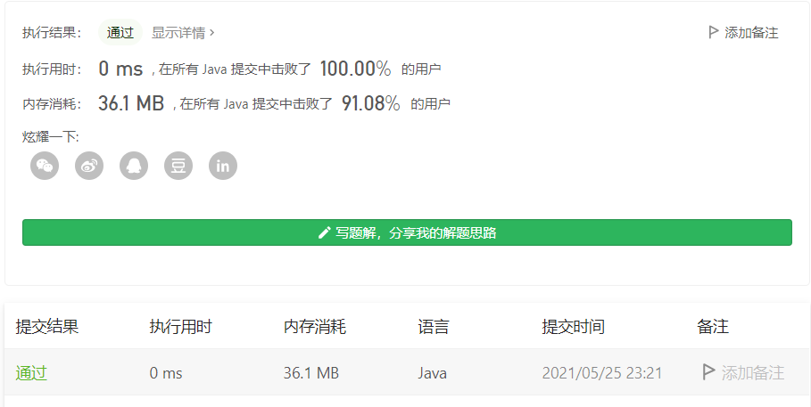

#### 剑指 Offer 05. 替换空格

链接：https://leetcode-cn.com/problems/ti-huan-kong-ge-lcof/

标签：**字符串**

> 题目

请实现一个函数，把字符串 `s` 中的每个空格替换成"%20"。

```java
输入：s = "We are happy."
输出："We%20are%20happy."
    
0 <= s 的长度 <= 10000
```

> 分析

对于这题思路很简单，只需要遍历字符串s，然后判断是否为空格，是就进行替换，不是就原样。保存结果可以使用StringBuilder或者StringBuffer，StringBuffer是线程安全的，StringBuilder是线程不安全的，这里不涉及多线程，所以使用StringBuilder效率更高。StringBuffer和StringBuilder拼接字符串都比String的效率高。

> 编码

```java
class Solution {
    public String replaceSpace(String s) {
        StringBuilder sb = new StringBuilder();
        for (int i = 0; i < s.length(); i++) {
            char c = s.charAt(i);
            if (c == ' ') {
                sb.append("%20");
                continue;
            }
            sb.append(c);
        }

        return sb.toString();
    }
}
```



时间复杂度O(n)，空间复杂度O(1)