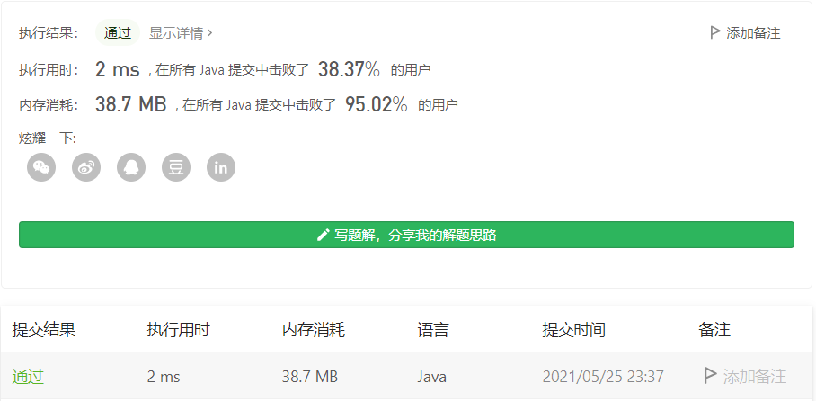

#### 剑指 Offer 06. 从尾到头打印链表

链接：https://leetcode-cn.com/problems/cong-wei-dao-tou-da-yin-lian-biao-lcof/

标签：**链表**

> 题目

输入一个链表的头节点，从尾到头反过来返回每个节点的值（用数组返回）。

```java
输入：head = [1,3,2]
输出：[2,3,1]
    
0 <= 链表长度 <= 10000
```

> 分析

这题要你从尾到头打印链表，也就是倒序输出链接，但它要的返回值是一个数组。

解法一：**双端队列法**。使用双端队列，遍历链表，每次插入链表的头部。然后遍历队列，每次从队列尾部拿数据放入数组即可。

解法二：先遍历一遍链表，求出链表总共有多少个元素，然后再次遍历链表，把值从数组的尾部往前插入即可。

> 编码

**解法一**：

```java
/**
 * Definition for singly-linked list.
 * public class ListNode {
 *     int val;
 *     ListNode next;
 *     ListNode(int x) { val = x; }
 * }
 */
class Solution {
    public int[] reversePrint(ListNode head) {
        Deque<Integer> res = new LinkedList<>();
        int count = 0;

        while (head != null) {
            res.offerFirst(head.val);
            head = head.next;
            count++;
        }

        int[] values = new int[count];
        count = 0;
        while (!res.isEmpty()) {
            values[count++] = res.poll();
        }

        return values;
    }
}
```

时间复杂度O(n)，空间复杂度O(n)



**解法二**：

```java
/**
 * Definition for singly-linked list.
 * public class ListNode {
 *     int val;
 *     ListNode next;
 *     ListNode(int x) { val = x; }
 * }
 */
class Solution {
    public int[] reversePrint(ListNode head) {
        ListNode node1 = head;
        int count = 0;
        while (node1 != null) {
            count++;
            node1 = node1.next;
        }

        int[] nums = new int[count];
        ListNode node2 = head;
        while (node2 != null) {
            nums[--count] =  node2.val;
            node2 = node2.next;
        }
        
        return nums;
    }
}
```

时间复杂度O(n)， 空间复杂度O(n)

