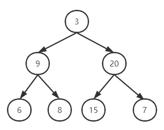

#### 剑指 Offer 07. 重建二叉树

链接：https://leetcode-cn.com/problems/zhong-jian-er-cha-shu-lcof/

标签：**树、递归**

> 题目

输入某二叉树的前序遍历和中序遍历的结果，请重建该二叉树。假设输入的前序遍历和中序遍历的结果中都不含重复的数字。

例如，给出

```java
前序遍历 preorder = [3,9,20,15,7]
中序遍历 inorder = [9,3,15,20,7]
```

返回如下的二叉树：

```java
    3
   / \
  9  20
    /  \
   15   7
```

**限制：**

```
0 <= 节点个数 <= 5000
```

> 分析

知道一棵树的先序遍历和中序遍历，可以还原一颗二叉树。知道一棵树的先序遍历和后续遍历，也可以还原一颗二叉树。但如果知道中序遍历和后序遍历，是无法还原二叉树的，因为无法区分左右子树。

对于此题，假设有一颗二叉树的先序序列[3, 9, 6, 8, 20, 15, 7]，中序序列[6, 9, 8, 3, 15, 20, 7]，树是下面这个样子的



我们还原的步骤如下：

（1）根据先序遍历节点3，是树的根节点，然后在中序序列里查找3的位置，3左边的节点[6, 9 ,8]组成树的左子树，3右边的节点[15, 20, 7]组成树的右子树。

（2）对左子树重复步骤（1）

（3）对右子树重复步骤（1）

此题的难点在于**如何确定左右子树的根节点**。对于左子树，preorder[i +1]就是根节点，对于右子树，因为先序遍历是先走根节点再走左子树，那么只需要知道当前左子树有几个节点，就可以知道右子树的根节点了。

> 编码

```java
/**
 * Definition for a binary tree node.
 * public class TreeNode {
 *     int val;
 *     TreeNode left;
 *     TreeNode right;
 *     TreeNode(int x) { val = x; }
 * }
 */
class Solution {
    public TreeNode buildTree(int[] preorder, int[] inorder) {
        return createTree(0, 0, inorder.length - 1, preorder, inorder);
    }

    private TreeNode createTree(int preStart, int inStart, int inEnd, int[] preorder, int[] inorder) {
        if (preStart >= preorder.length || inStart > inEnd) {
            return null;
        }

        // 根节点
        TreeNode root = new TreeNode(preorder[preStart]);
        int rootIndex = 0;
        // 查找根节点在中序数组里的位置，拆分左右子树
        for (int i = 0; i < inorder.length; i++) {
            if (preorder[preStart] == inorder[i]) {
                rootIndex = i;
                break;
            }
        }

        // 创建左子树
        root.left = createTree(preStart + 1, inStart, rootIndex - 1, preorder, inorder);
        // 创建右子树,rootIndex - inStart即当前左子树的节点数量
        root.right = createTree(preStart + 1 + rootIndex - inStart, rootIndex + 1, inEnd, preorder, inorder);
        return root;
    }
}
```

