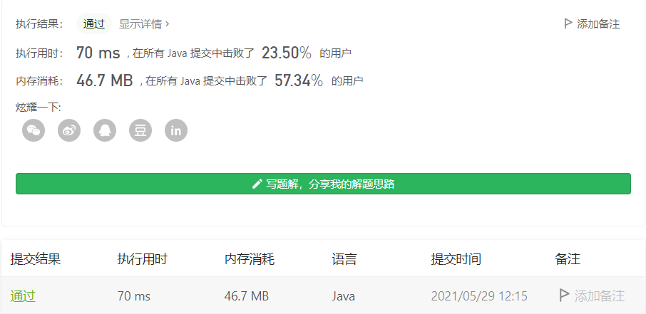
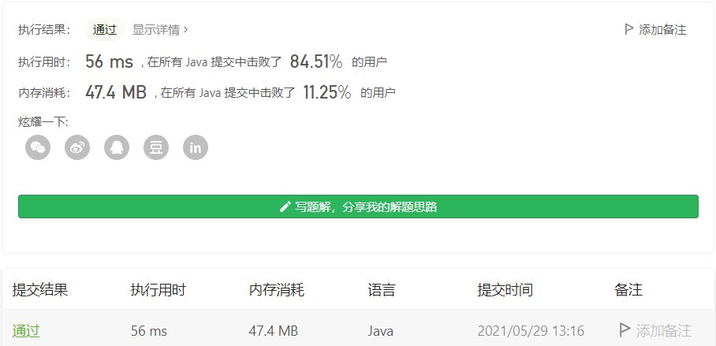

#### 剑指 Offer 09. 用两个栈实现队列

链接：https://leetcode-cn.com/problems/yong-liang-ge-zhan-shi-xian-dui-lie-lcof/

标签：**栈、设计**

> 题目

用两个栈实现一个队列。队列的声明如下，请实现它的两个函数 appendTail 和 deleteHead ，分别完成在队列尾部插入整数和在队列头部删除整数的功能。(若队列中没有元素，deleteHead 操作返回 -1 )

```java
输入：
["CQueue","appendTail","deleteHead","deleteHead"]
[[],[3],[],[]]
输出：[null,null,3,-1]

输入：
["CQueue","deleteHead","appendTail","appendTail","deleteHead","deleteHead"]
[[],[],[5],[2],[],[]]
输出：[null,-1,null,null,5,2]

1 <= values <= 10000
最多会对 appendTail、deleteHead 进行 10000 次调用
```

> 题目

栈的特性是后进先出，数据插入时在栈顶，弹出的时候也从栈顶弹出。而队列是先进先出，数据插入时在队列尾，弹出队列头。

题目是用两个栈实现一个队列，在队列尾部插入元素，然后在队列头部删除元素，**也就是删除先加入的元素**。基本思路是这样的，插入时将元素放入一个栈，删除元素的时候，因为需要删除队列头，即后加入的元素，所以需要把栈1的元素倒序，即把栈1的元素弹出然后放入栈2（在栈2为空的情况下）

> 编码

```java
class CQueue {

    Stack<Integer> stack1;
    Stack<Integer> stack2;

    public CQueue() {
        stack1 = new Stack<>();
        stack2 = new Stack<>();
    }
    
    public void appendTail(int value) {
        stack1.push(value);
    }
    
    public int deleteHead() {
        if (stack2.empty()) {
            while (!stack1.empty()) {
                stack2.push(stack1.pop());
            }
        }

        return stack2.empty() ? -1 : stack2.pop();
    }
}

/**
 * Your CQueue object will be instantiated and called as such:
 * CQueue obj = new CQueue();
 * obj.appendTail(value);
 * int param_2 = obj.deleteHead();
 */
```



如果使用Stack的方式来做这道题，会造成速度较慢； 原因是Stack继承了Vector接口，而Vector底层是一个Object[]数组，那么就要考虑空间扩容和移位的问题了。 可以使用LinkedList来做Stack的容器，因为LinkedList实现了Deque接口，所以Stack能做的事LinkedList都能做，其本身结构是个双向链表，扩容消耗少。 

```java
class CQueue {

    Deque<Integer> stack1;
    Deque<Integer> stack2;

    public CQueue() {
        stack1 = new LinkedList<>();
        stack2 = new LinkedList<>();
    }
    
    public void appendTail(int value) {
        stack1.push(value);
    }
    
    public int deleteHead() {
        if (stack2.isEmpty()) {
            while (!stack1.isEmpty()) {
                stack2.push(stack1.pop());
            }
        }

        return stack2.isEmpty() ? -1 : stack2.pop();
    }
}

/**
 * Your CQueue object will be instantiated and called as such:
 * CQueue obj = new CQueue();
 * obj.appendTail(value);
 * int param_2 = obj.deleteHead();
 */
```

