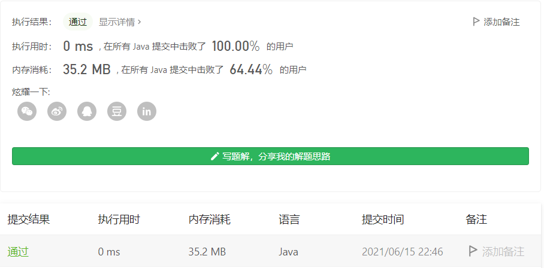

#### 剑指 Offer 10- I. 斐波那契数列

#### 2021-09-04 LeetCode每日一题

链接：https://leetcode-cn.com/problems/fei-bo-na-qi-shu-lie-lcof/

标签：**动态规划、递归**

> 题目

写一个函数，输入 n ，求斐波那契（Fibonacci）数列的第 n 项（即 F(N)）。斐波那契数列的定义如下：

```java
F(0) = 0,   F(1) = 1
F(N) = F(N - 1) + F(N - 2), 其中 N > 1.
```

斐波那契数列由 0 和 1 开始，之后的斐波那契数就是由之前的两数相加而得出。

答案需要取模 1e9+7（1000000007），如计算初始结果为：1000000008，请返回 1。

```java
输入：n = 2
输出：1
    
输入：n = 5
输出：5
```

**提示：**

- `0 <= n <= 100`

> 分析

这算是耳熟能详的一道题目了。定义dp[i] 表示斐波那契第i项的值，初始化dp[0] = 0, dp[1] = 1，则

dp[i] = dp[i - 2] + dp[i - 1]    i >= 2

因为只和两个状态有关，所有我们可以使用两个变量表示dp[i - 1] 和 dp[i - 2]，把空间复杂度降到O(1)。

此题也可使用递归，但需要记录中间状态，避免重复计算，不然会超时。因为全局变量执行所有测试用例只会初始化一次，所以可以在函数外定义一个缓存数组。

```java
// 这样会超时
class Solution {
    public int fib(int n) {
        if (n == 0 || n == 1) {
            return n;
        }

        return (fib(n - 1) + fib(n - 2)) % 1000000007;
    }
}
```

> 编码

**迭代法**：

```java
class Solution {
    public int fib(int n) {
        if (n == 0 || n == 1) {
            return n;
        }

        int a = 0, b = 1, res = 0;
        for (int i = 2; i <= n; i++) {
            res = a + b;
            if (res >= 1000000007) {
                res = res % 1000000007;
            }

            a = b;
            b = res;
        }

        return res;
    }
}
```



**递归法**：

```java
class Solution {
    int[] cache = new int[101];
    public int fib(int n) {
        if (n == 0 || n == 1) {
            return n;
        }
        if (cache[n] != 0) {
            return cache[n];
        }

        cache[n] = (fib(n - 1) + fib(n - 2)) % 1000000007;
        return cache[n];
    }
}
```

