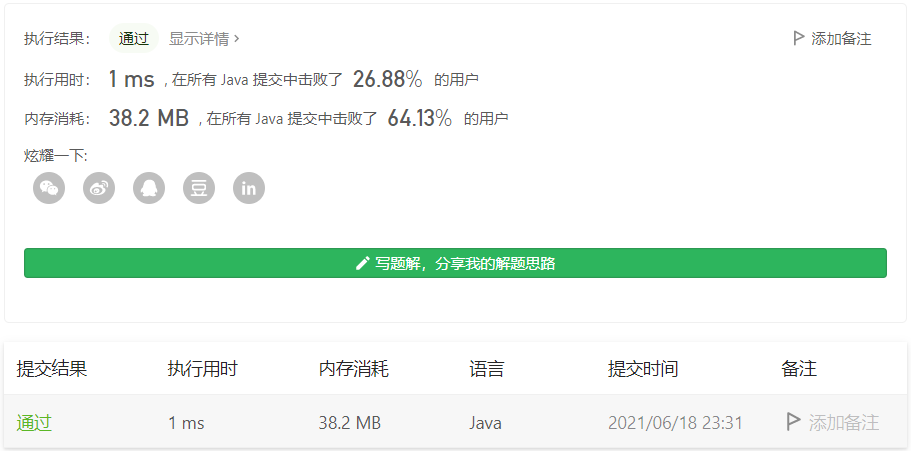

#### 剑指 Offer 11. 旋转数组的最小数字

链接：https://leetcode-cn.com/problems/xuan-zhuan-shu-zu-de-zui-xiao-shu-zi-lcof/

标签：**数组、二分**

> 题目

把一个数组最开始的若干个元素搬到数组的末尾，我们称之为数组的旋转。输入一个递增排序的数组的一个旋转，输出旋转数组的最小元素。例如，数组 [3,4,5,1,2] 为 [1,2,3,4,5] 的一个旋转，该数组的最小值为1。  

```java
输入：[3,4,5,1,2]
输出：1
    
输入：[2,2,2,0,1]
输出：0
```

> 分析

方法1：普通循环。

方法2：二分查找。


> 编码

**普通循环**：

```java
class Solution {
    public int minArray(int[] numbers) {
        int min = numbers[0];

        for (int i = 1; i < numbers.length; i++) {
            if (numbers[i] < min) {
                min = numbers[i];
            }
        }

        return min;
    }
}
```

