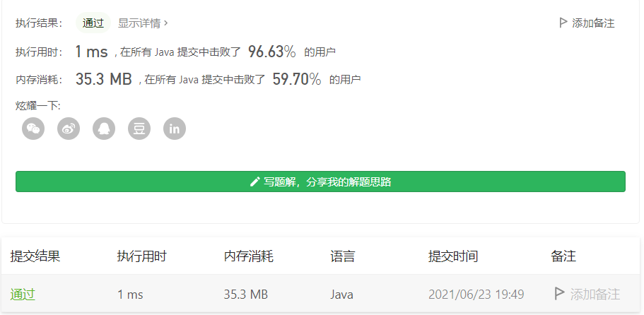
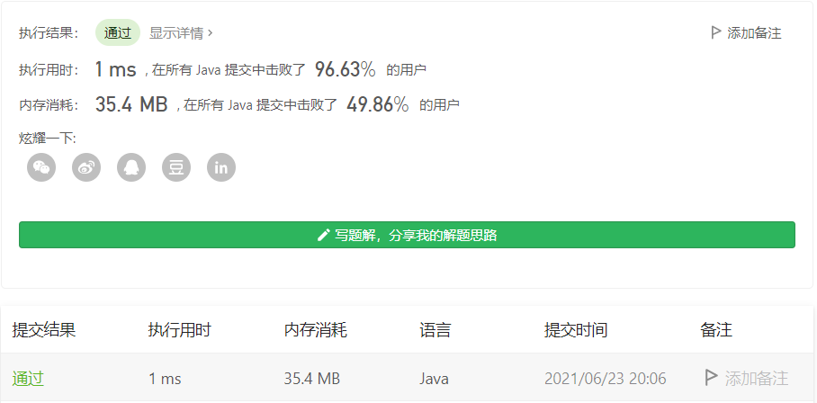
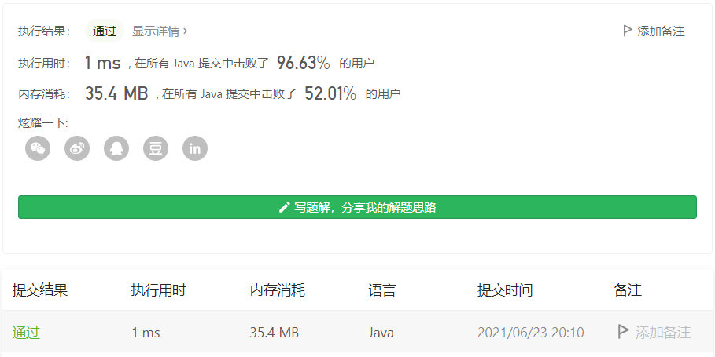

#### 剑指 Offer 15. 二进制中1的个数

#### 2021-06-23 LeetCode每日一题

链接：https://leetcode-cn.com/problems/er-jin-zhi-zhong-1de-ge-shu-lcof/

标签：**位运算**

> 题目

请实现一个函数，输入一个整数（以二进制串形式），输出该数二进制表示中 1 的个数。例如，把 9 表示成二进制是 1001，有 2 位是 1。因此，如果输入 9，则该函数输出 2。

 ```java
输入：00000000000000000000000000001011
输出：3
解释：输入的二进制串 00000000000000000000000000001011 中，共有三位为 '1'。

输入：00000000000000000000000010000000
输出：1
解释：输入的二进制串 00000000000000000000000010000000 中，共有一位为 '1'。

输入：11111111111111111111111111111101
输出：31
解释：输入的二进制串 11111111111111111111111111111101 中，共有 31 位为 '1'。
 ```

**提示：**

- 输入必须是长度为 `32` 的 **二进制串** 。

> 分析

这题解法好多，但我们要做最快的那个男人。


（1）解法1：利用n & (n - 1)的特性。对于一个数n，n & (n - 1)可以把n最低位的1置为0，所以利用这个特性，可以很快求得n表示的二进制有几个1。

（2）解法2：对n表示的二进制进行移位，判断每位是否等1。

（3）解法3：Java内置api。

> 编码

解法1：

```java
public class Solution {
    // you need to treat n as an unsigned value
    public int hammingWeight(int n) {
        int res = 0;
        while (n != 0) {
            n = n & (n - 1);
            res++;
        }

        return res;
    }
}
```



解法2：

```java
public class Solution {
    // you need to treat n as an unsigned value
    public int hammingWeight(int n) {
        int res = 0;
        for (int i = 0; i < 32; i++) {
            if (((n >> i) & 1) == 1) {
                res++;
            }
        }

        return res;
    }
}
```



解法3：

```java
public class Solution {
    // you need to treat n as an unsigned value
    public int hammingWeight(int n) {
        return Integer.bitCount(n);
    }
}
```

