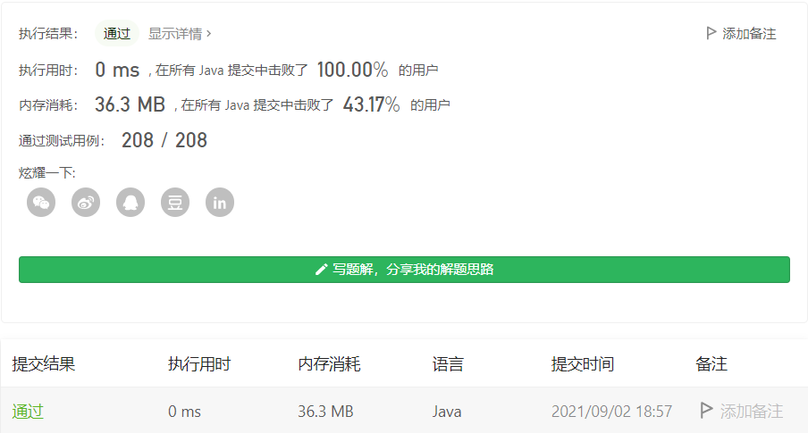

#### 剑指 Offer 22. 链表中倒数第k个节点

#### 2021-09-02 LeetCode每日一题

链接：https://leetcode-cn.com/problems/lian-biao-zhong-dao-shu-di-kge-jie-dian-lcof/

标签：**链表、双指针**

> 题目

输入一个链表，输出该链表中倒数第k个节点。为了符合大多数人的习惯，本题从1开始计数，即链表的尾节点是倒数第1个节点。

例如，一个链表有 6 个节点，从头节点开始，它们的值依次是 1、2、3、4、5、6。这个链表的倒数第 3 个节点是值为 4 的节点。

示例：

```java
给定一个链表: 1->2->3->4->5, 和 k = 2.

返回链表 4->5.
```

> 分析

很经典的链表题目，使用快慢指针即可。先让指针p1走k步，接下来指针p1和p2一起走，当p1到达链表末尾的时候，p2所在的位置就是倒数第k个节点。这样只需要遍历一次即可。

> 编码

```java
/**
 * Definition for singly-linked list.
 * public class ListNode {
 *     int val;
 *     ListNode next;
 *     ListNode(int x) { val = x; }
 * }
 */
class Solution {
    public ListNode getKthFromEnd(ListNode head, int k) {
        ListNode frontNode = head, behindNode = head;

        // 先走k个节点，剩下就还有len - k个节点
        while (k-- > 0) {
            frontNode = frontNode.next;
        }

        // 这里其实就是移动len - k个节点，刚好是倒数第K个节点
        while (frontNode != null) {
            frontNode = frontNode.next;
            behindNode = behindNode.next;
        }

        return behindNode;
    }
}
```

