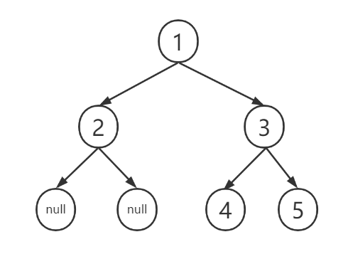
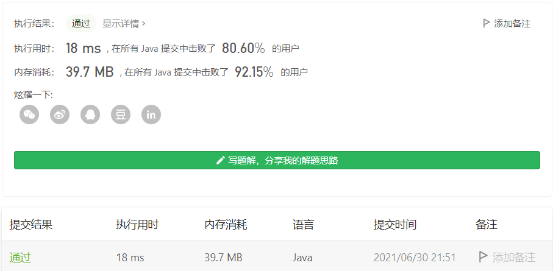

#### 剑指 Offer 37. 序列化二叉树

#### 2021-06-30 LeetCode每日一题

链接：https://leetcode-cn.com/problems/xu-lie-hua-er-cha-shu-lcof/

标签：**树、深度优先搜索、广度优先搜索、设计、字符串、二叉树**

> 题目

请实现两个函数，分别用来序列化和反序列化二叉树。

你需要设计一个算法来实现二叉树的序列化与反序列化。这里不限定你的序列 / 反序列化算法执行逻辑，你只需要保证一个二叉树可以被序列化为一个字符串并且将这个字符串反序列化为原始的树结构。

提示：输入输出格式与 LeetCode 目前使用的方式一致，详情请参阅 LeetCode 序列化二叉树的格式。你并非必须采取这种方式，你也可以采用其他的方法解决这个问题。


```java
输入：root = [1,2,3,null,null,4,5]
输出：[1,2,3,null,null,4,5]
```

> 分析

如果要构建一棵树的话，通过前序遍历和中序遍历可以确定一棵树，通过中序遍历和后续遍历也可以确定一棵树。

所以这题我们可以先得出二叉树的前序遍历和中序遍历(或者中序遍历和后续遍历)，转为字符串返回。然后再把字符串转为两个序列，通过这两个序列重新构建二叉树。做起来有点繁琐。

可以看到示例给的输入是层序遍历，所以我们可以通过BFS得到树的层序遍历，再通过层序遍历的结果还原二叉树。根据示例的输出结果可知，我们只需要让树变成完全二叉树（即先填满左子树再填满右子树），所以左子树空缺的节点我们需要置为null。

示例树就变成下面这样



> 编码

```java
/**
 * Definition for a binary tree node.
 * public class TreeNode {
 *     int val;
 *     TreeNode left;
 *     TreeNode right;
 *     TreeNode(int x) { val = x; }
 * }
 */
public class Codec {
    // Encodes a tree to a single string.
    public String serialize(TreeNode root) {
        StringBuilder sb = new StringBuilder();
        Queue<TreeNode> queue = new LinkedList<>();
        queue.offer(root);

        while (!queue.isEmpty()) {
            int len = queue.size();
            for (int i = 0; i < len; i++) {
                TreeNode node = queue.poll();
                // 这里直接追加逗号，这样在split进行分割的时候，就会把末尾的空字符全部去掉
                // 对于示例，得到的字符串是1,2,3,,,4,5,,,,
                // split进行分割后，得到字符串数组["1", "2", "3", "", "", "4", "5"]
                if (node == null) {
                    sb.append(",");
                } else {
                    sb.append(node.val).append(",");
                    queue.offer(node.left);
                    queue.offer(node.right);
                }
            }
        }
        return sb.substring(0, sb.length() - 1).toString();
    }

    // Decodes your encoded data to tree.
    public TreeNode deserialize(String data) {
        Queue<TreeNode> queue = new LinkedList<>();
        String[] vals = data.split(",");
        TreeNode root = (!"".equals(vals[0])) ? (new TreeNode(Integer.parseInt(vals[0]))) : null;
        TreeNode node = root;
        queue.offer(node);
        int index = 1;
        while (!queue.isEmpty() && index < vals.length) {
            int len = queue.size();
            for (int i = 0; i < len && index < vals.length; i++) {
                TreeNode temp = queue.poll();
                if (temp == null) {
                    continue;
                }
     
                String str = vals[index++];
                temp.left = !"".equals(str) ? new TreeNode(Integer.parseInt(str)) : null;
                if (index >= vals.length) {
                    break;
                }
                str = vals[index++];
                temp.right = !"".equals(str) ? new TreeNode(Integer.parseInt(str)) : null;
                queue.offer(temp.left);
                queue.offer(temp.right);
            }
        }

        return root;
    }
}

// Your Codec object will be instantiated and called as such:
// Codec codec = new Codec();
// codec.deserialize(codec.serialize(root));
```

