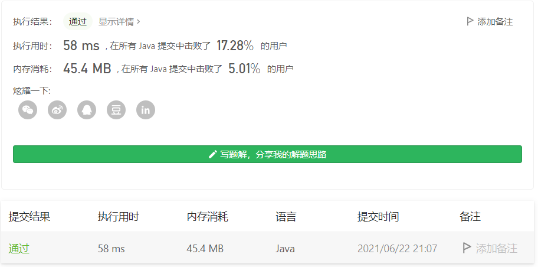

#### 剑指 Offer 38. 字符串的排列

#### 2021-06-22 LeetCode每日一题

链接：https://leetcode-cn.com/problems/zi-fu-chuan-de-pai-lie-lcof/

标签：**回溯**

> 题目

输入一个字符串，打印出该字符串中字符的所有排列。

你可以以任意顺序返回这个字符串数组，但里面不能有重复元素。

```java
输入：s = "abc"
输出：["abc","acb","bac","bca","cab","cba"]
```

**限制：**

```
1 <= s 的长度 <= 8
```

> 分析

这种求全排列的问题，首先想到回溯法。但这里给定的字符串中可能存在重复字符，所以需要去重，利用Set进行存储即可。

比如给定字符串abc，大致流程如下：

- 遍历字符串，对于a，没有访问过，加入临时数组temp，并将a置为已访问。对于bc进行同样的操作。此时一轮遍历完成。temp的字符数量等于给定字符串，将temp加入Set，进行return。得到abc
- return后就进行回溯，回到上一层，将temp的最后一个元素的访问状态置为未访问，此时下标等于数组长度，没有可访问的字符。再回溯到上一层，此时只有a是已访问，并且下标指向的是b，下标加1指向c进入循环，发现c没有被访问，于是将c加入temp，然后又重新开始遍历字符串，发现b还没有被访问，将b加入temp。temp的字符数量等于给定字符串，将temp加入Set，进行return。得到acb。
- 重复上面的步骤

> 编码

```java
class Solution {
    public String[] permutation(String s) {
        // Set去重
        Set<String> set = new HashSet<>();
        char[] chs = s.toCharArray();
        // 记录已经访问过的字符
        boolean[] visited = new boolean[s.length()];
        char[] temp = new char[s.length()];
        backTrace(0, chs, set, visited, temp);
        StringBuilder sb = new StringBuilder();
        set.stream().forEach(str -> {
            sb.append(str + ",");
        });
        return sb.substring(0, sb.length() - 1).toString().split(",");
    }

    private void backTrace(int index, char[] chs, Set<String> set, boolean[] visited, char[] con) {
        if (index == chs.length) {
            set.add(new String(con));
            return;
        }

        for (int i = 0; i < chs.length; i++) {
            if (!visited[i]) {
                visited[i] = true;
                con[index] = chs[i];
                backTrace(index + 1, chs, set, visited, con);
                visited[i] = false;
            }
        }
    }
}
```

