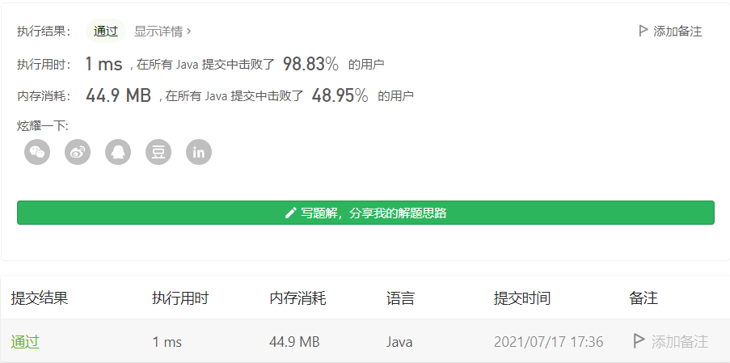
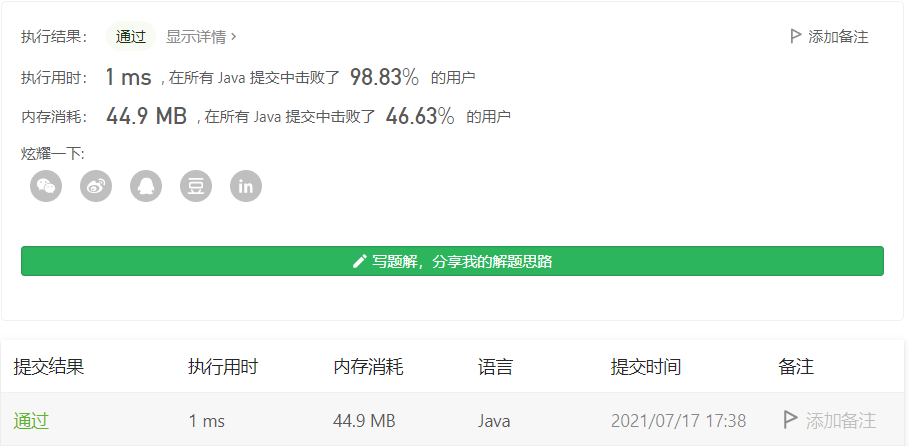

#### 剑指 Offer 42. 连续子数组的最大和

#### 2021-07-17 LeetCode每日一题

链接：https://leetcode-cn.com/problems/lian-xu-zi-shu-zu-de-zui-da-he-lcof/

标签：**数组、动态规划**

> 题目

输入一个整型数组，数组中的一个或连续多个整数组成一个子数组。求所有子数组的和的最大值。

要求时间复杂度为O(n)。

示例1:

```java
输入: nums = [-2,1,-3,4,-1,2,1,-5,4]
输出: 6
解释: 连续子数组 [4,-1,2,1] 的和最大，为 6。
```


提示：

- 1 <= arr.length <= 10^5
- -100 <= arr[i] <= 100

> 分析

定义dp[i] 表示以num[i]结尾的子数组和的最大值。则dp[i]有以下两种情况：

- num[i]单独组成子数组，此时dp[i] = num[i]。
- num[i]和前面的数组成子数组，此时dp[i] = dp[i - 1] + num[i]

> 编码

```java
class Solution {
    public int maxSubArray(int[] nums) {
        int len = nums.length;
        int ans = Integer.MIN_VALUE, sum = 0;
        for (int i = 0; i < len; i++) {
            sum += nums[i];
            if (sum > ans) {
                ans = sum;
            }

            if (sum < 0) {
                sum = 0;
            }
        }

        return ans;
    }
}
```



```java
class Solution {
    public int maxSubArray(int[] nums) {
        int len = nums.length, max = nums[0];
        int[] dp = new int[len];
        dp[0] = nums[0];

        for (int i = 1; i < len; i++) {
            dp[i] = Math.max(nums[i], dp[i - 1] + nums[i]);
            max = Math.max(dp[i], max);
        }

        return max;
    }
}
```

