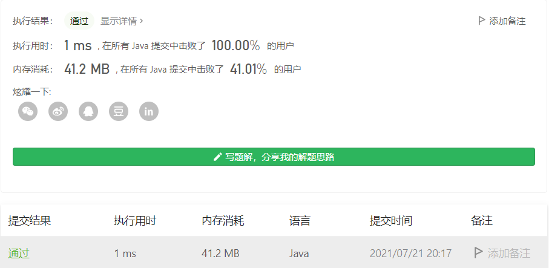
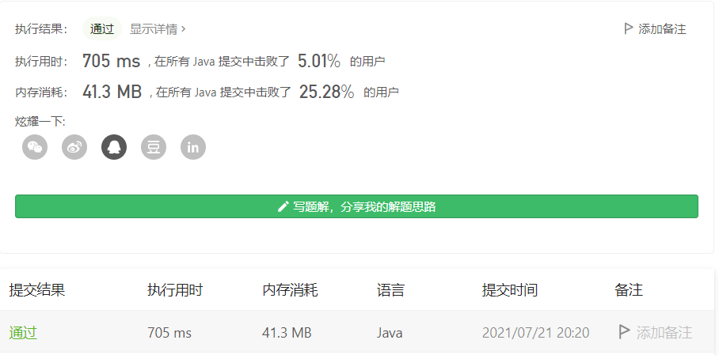

#### 剑指 Offer 52. 两个链表的第一个公共节点

#### 2021-07-21 LeetCode每日一题

链接：https://leetcode-cn.com/problems/liang-ge-lian-biao-de-di-yi-ge-gong-gong-jie-dian-lcof/

标签：**哈希表、链表、双指针**

> 题目

输入两个链表，找出它们的第一个公共节点。

如下面的两个链表**：**


在节点 c1 开始相交。

**示例 1：**


```java
输入：intersectVal = 8, listA = [4,1,8,4,5], listB = [5,0,1,8,4,5], skipA = 2, skipB = 3
输出：Reference of the node with value = 8
输入解释：相交节点的值为 8 （注意，如果两个列表相交则不能为 0）。从各自的表头开始算起，链表 A 为 [4,1,8,4,5]，链表 B 为 [5,0,1,8,4,5]。在 A 中，相交节点前有 2 个节点；在 B 中，相交节点前有 3 个节点。
```

**示例 2：**


```java
输入：intersectVal = 2, listA = [0,9,1,2,4], listB = [3,2,4], skipA = 3, skipB = 1
输出：Reference of the node with value = 2
输入解释：相交节点的值为 2 （注意，如果两个列表相交则不能为 0）。从各自的表头开始算起，链表 A 为 [0,9,1,2,4]，链表 B 为 [3,2,4]。在 A 中，相交节点前有 3 个节点；在 B 中，相交节点前有 1 个节点。
```

**示例 3：**


```java
输入：intersectVal = 0, listA = [2,6,4], listB = [1,5], skipA = 3, skipB = 2
输出：null
输入解释：从各自的表头开始算起，链表 A 为 [2,6,4]，链表 B 为 [1,5]。由于这两个链表不相交，所以 intersectVal 必须为 0，而 skipA 和 skipB 可以是任意值。
解释：这两个链表不相交，因此返回 null。
```


注意：

- 如果两个链表没有交点，返回 null.
- 在返回结果后，两个链表仍须保持原有的结构。
- 可假定整个链表结构中没有循环。
- 程序尽量满足 O(n) 时间复杂度，且仅用 O(1) 内存。

> 分析

如果在纸上画一画，就能想到一种简单的方法（a + b = b + a）。没想到那就朴素一点，普通循环。

> 编码

**好方法**：

```java
/**
 * Definition for singly-linked list.
 * public class ListNode {
 *     int val;
 *     ListNode next;
 *     ListNode(int x) {
 *         val = x;
 *         next = null;
 *     }
 * }
 */
public class Solution {
    public ListNode getIntersectionNode(ListNode headA, ListNode headB) {
        ListNode A = headA, B = headB;

        // 如果两个链表没有公共节点，那么最后都会等于null
        while (A != B) {
            // 最好的情况就是两个链表长度相等
            // 两个链表长度不想等的时候，短的先走完，这时候让它从长链表的头节点开始走，等长的走完后
            // 让长的从短链表的头结点开始，此时两个节点是距离公共节点是一样的
            A = (A == null ? headB : A.next);
            B = (B == null ? headA : B.next);
        }

        return A;
    }
}
```



**朴素法**：

```java
/**
 * Definition for singly-linked list.
 * public class ListNode {
 *     int val;
 *     ListNode next;
 *     ListNode(int x) {
 *         val = x;
 *         next = null;
 *     }
 * }
 */
public class Solution {
    public ListNode getIntersectionNode(ListNode headA, ListNode headB) {
        ListNode A = headA;
        while (A != null) {
            ListNode B = headB;
            while (B != null && B != A) {
                B = B.next;
            }

            if (B != null) {
                return B;
            }

            A = A.next;
        }

        return null;
    }
}
```

