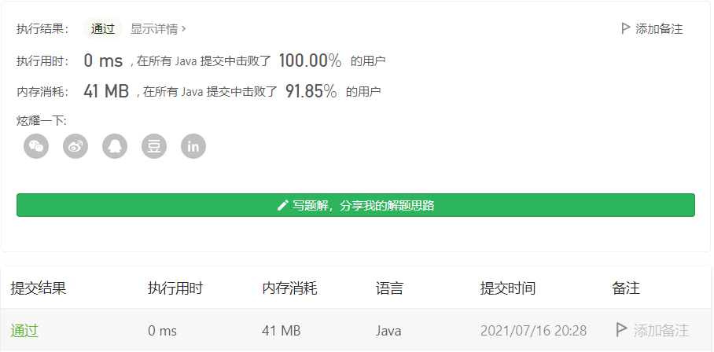

#### 剑指 Offer 53 - I. 在排序数组中查找数字 I

#### 2021-07-16 LeetCode每日一题

链接：https://leetcode-cn.com/problems/zai-pai-xu-shu-zu-zhong-cha-zhao-shu-zi-lcof/

标签：**数组、二分查找**

> 题目

统计一个数字在排序数组中出现的次数。

示例 1:

```java
输入: nums = [5,7,7,8,8,10], target = 8
输出: 2
```

示例 2:

```java
输入: nums = [5,7,7,8,8,10], target = 6
输出: 0
```


限制：

- 0 <= 数组长度 <= 50000

> 分析

题目给定的是有序数组，所以除了直接循环遍历外，另一种方法就是**二分查找**，找到一个目标数的位置后，再往左右两步走，直到全部找到。

> 编码

```java
class Solution {
    public int search(int[] nums, int target) {
        int len = nums.length;
        int left = 0, right = len - 1, count = 0, mid = 0;
        while (left <= right) {
            mid = left + (right - left) / 2;
            if (nums[mid] < target) {
                left = mid + 1;
            } else if (nums[mid] > target) {
                right = mid - 1;
            } else {
                break;
            }
        }

        int temp = mid;
        while (temp >=0 && temp < len && nums[temp] == target) {
            count++;
            temp--;
        }

        temp = mid + 1;
        while (temp >=0 && temp < len && nums[temp] == target) {
            count++;
            temp++;
        }

        return count;
    }
}
```

